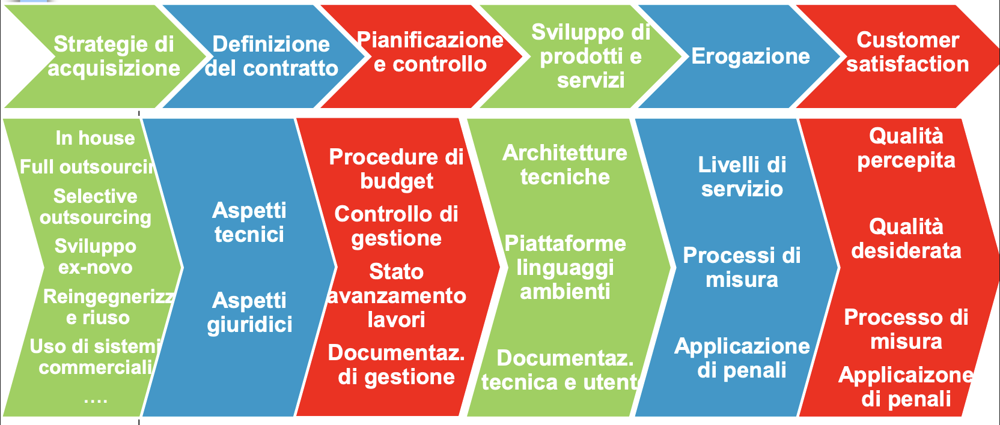
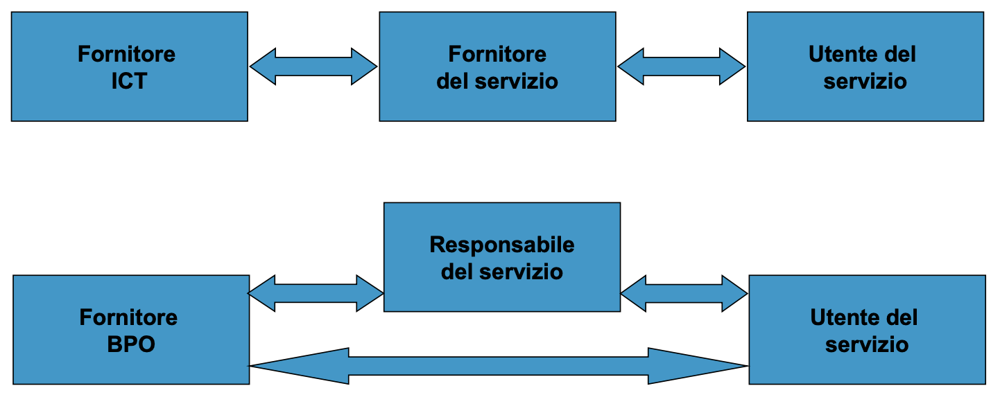
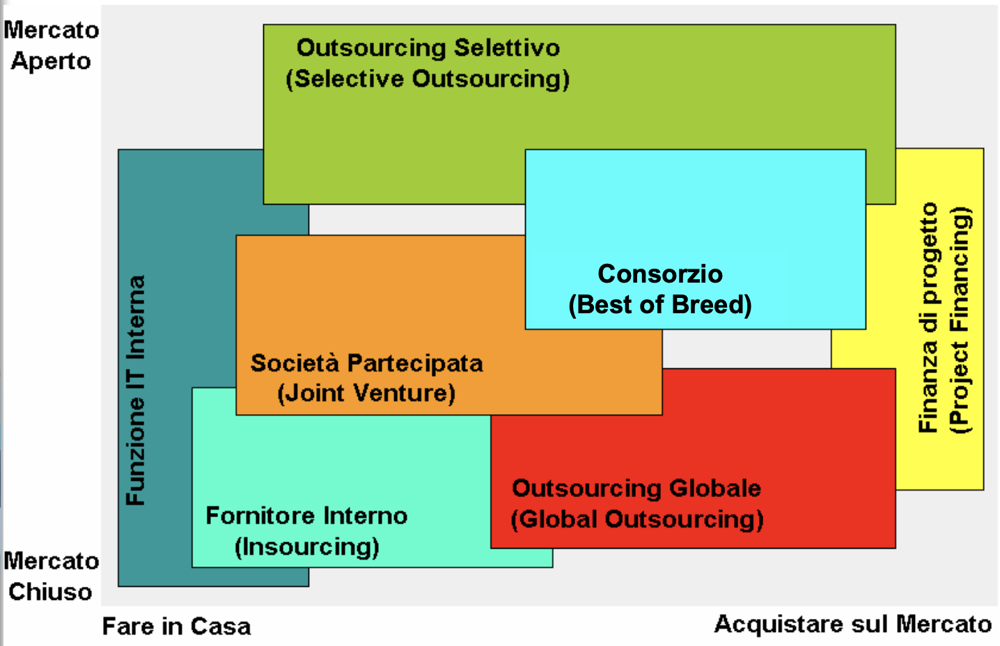
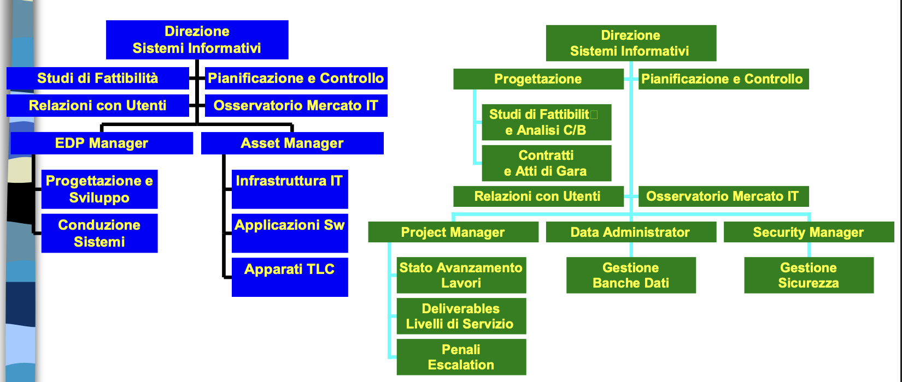
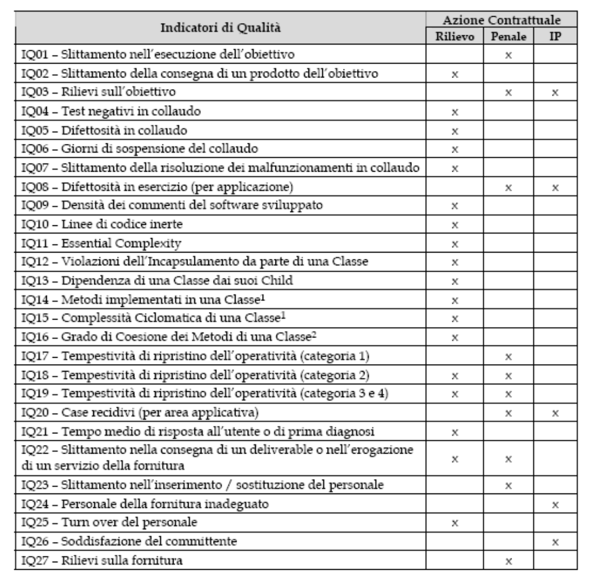

# Il ciclo di vita di un progetto informatico

## Sistemi Informativi

**Prof. Matteo Golfarelli**  
Alma Mater Studiorum - Università di Bologna

---

## Il ciclo di vita di un progetto SI

Per arrivare a mettere in campo un progetto ci sono diverse fasi preparatorie che dobbiamo completare prima dello sviluppo.

Il ciclo di vita dei progetti approvati in fase di pianificazione comprende le seguenti fasi principali:

- **Strategie di acquisizione**: In house, Full outsourcing, Selective outsourcing
- **Sviluppo di prodotti e servizi**: Sviluppo ex-novo, Reingegnerizzazione e riuso, Uso di sistemi commerciali, Architetture tecniche, Piattaforme linguaggi ambienti, Documentazione tecnica e utente
- **Definizione del contratto**: Aspetti tecnici, Aspetti giuridici, Livelli di servizio, Processi di misura, Applicazione di penali
- **Pianificazione e controllo**: Procedure di budget, Controllo di gestione, Stato avanzamento lavori, Documentazione di gestione
- **Erogazione**
- **Customer satisfaction**: Qualità percepita, Qualità desiderata, Processo di misura, Applicazione di penali

---

## Strategie di acquisizione: Make or Buy?

La realtà è molto complessa, per commentarla è utile schematizzare, ma con spirito critico:

- Quasi nessuno fa tutto in casa
- L'affidamento totale all'esterno è raro (e se estremo e non governato è molto pericoloso e potenzialmente inefficace e inefficiente)

È necessario distinguere i termini:

- **Acquisto sul mercato di un bene o servizio**: accezione generica riferita alla scelta di acquisire da terzi (Buy) invece che realizzare internamente (Make) un bene o un servizio
- **Esternalizzazione (outsourcing)**: presuppone una qualche forma di stabilità del rapporto di "collaborazione" tra l'impresa e il terzista con una prospettiva di medio termine

---

## Strategie di acquisizione: fare o affidare?

L'outsourcing ha luogo quando un'organizzazione affida tramite un accordo contrattuale a un fornitore esterno la responsabilità di una o più funzioni o servizi specializzati precedentemente svolti internamente.

**Vantaggi:**

- Riduzione dei costi di gestione: l'outsourcer riesce a conseguire profitti per effetto delle sue competenze specialistiche e delle economie di scala
- Benefici finanziari: l'outsourcing evita la necessità di investimenti in beni immobili
- Aumento del livello qualitativo del servizio
- Accesso a tecnologie avanzate
- Possibilità di incrementi di capacità a richiesta

---

## Outsourcing: due coordinate per classificarlo

**In base alla missione affidata al Fornitore:**

- Information Technology Outsourcing (ITO)
- Business Process Outsourcing

**In base all'ampiezza del mandato conferito al Fornitore:**

- Full Outsourcing
- Selective Outsourcing

---

## Information Technology Outsourcing

Outsourcing delle attività di sviluppo, esercizio, manutenzione dei Sistemi Informativi e delle risorse informatiche.

Può essere (seconda coordinata):

- Full Outsourcing
- Selective Outsourcing (spesso "Multisourcing")

---

## Tipi di servizi affidati in outsourcing

- **Application management**: Manutenzione e conduzione patrimonio applicativo software
- **Application service provision**: Servizi di consulenza
- **Direzione lavori, monitoraggio, consulenza e formazione**
- **Desktop management**: Gestione delle postazioni di lavoro, assistenza, controllo, manutenzione HW e SW
- **Network outsourcing**: Servizi di connettività e relativa gestione delle correlate apparecchiature di rete
- **Facility management**: Gestione delle infrastrutture HW (presso locali del committente o del fornitore), spesso con disaster recovery e business continuity
- **System integration**
- **Help desk, CRM**: Infrastrutture e anche servizio (BPO)

---

## Business Process Outsourcing (BPO)

Outsourcing di processi operativi dell'organizzazione, di solito "strumentali" e non "core":

- Personale (Human Resources Management)
- Contabilità e finanza
- Assistenza agli utenti (Help Desk, Call Center)
- Relazioni con gli utenti (Customer Relationship Management)
- Acquisti e forniture (Supply Chain Management)
- Commercio elettronico su internet (e-Commerce)

Alcuni casi di servizi "core", con (nel settore pubblico) rapporti "stretti" di partnership fra amministrazione e fornitore.

---

## Scenario tradizionale vs BPO

**Scenario tradizionale:**

- Responsabile del servizio → Fornitore ICT
- Responsabile del servizio → Fornitore del servizio
- Fornitore del servizio → Utente del servizio

**Scenario BPO:**

- Responsabile del servizio → Fornitore BPO → Utente del servizio

---

## Un esempio: Servizi di BPO di Accenture

**Cross-Industry BPO Services:**

- Engineering BPO
- Finance & Accounting BPO
- HR BPO
- Learning BPO
- Procurement BPO
- Supply Chain BPO

**Industry-Specific Services:**

- Credit Services BPO
- Health Administration BPO
- Insurance BPO
- Network BPO
- Utilities BPO

**Bundled Outsourcing Services**

Fonte: http://www.accenture.com/us-en/Pages/service-bpo-overview-summary.aspx

---

## Classificazione, due coordinate

**In base alla missione affidata al Fornitore:**

- Information Technology Outsourcing
- Business Process Outsourcing

**In base all'ampiezza del mandato conferito al Fornitore:**

- Full (Global) Outsourcing
- Selective Outsourcing

---

## Funzione IT Interna

La funzione IT è assegnata ad una struttura dell'organizzazione che fornisce ed implementa nuovi servizi ed architetture IT mediante progetti interni.

La funzione IT può comunque acquistare/affidare all'esterno le applicazioni, infrastrutture, HW.

---

## Insourcing

La funzione IT è delegata ad una società di servizi separata dall'organizzazione a cui fornisce servizi ma da essa posseduta (e che di solito non opera sul mercato) oppure è comunque formalizzato o quasi il rapporto fra struttura IT e altre strutture.

Fornisce ed implementa nuovi servizi ed architetture IT sulla base di contratti informali (controllo di gestione come centro di ricavi) o contratti di servizio (definizione di tariffe per i servizi).

Può a sua volta rivolgersi al mercato.

**Esempio tipico:**
Consip http://www.consip.it/on-line/Home/Chisiamo/Lanostramissione/Modello.html

Nel caso di Business Process Outsourcing si parla di **Captive company**: società "prigioniera" azienda fondata da altra azienda allo scopo di eseguire operazioni per conto dell'azienda madre (es. FGA Capital gestisce il processo di finanziamento per la società FGA - Fiat Group Automobiles).

---

## Selective Outsourcing

La funzione IT è delegata a più fornitori esterni che forniscono ed implementano nuovi servizi ed architetture IT sulla base di più contratti di durata limitata, 3-5 anni:

- Data center (Facility Management)
- Reti informatiche e/o telefoniche (Network Outsourcing)
- Desktop e sistemi distribuiti (Desktop Outsourcing)
- Applicazioni e procedure (Application Outsourcing)

L'organizzazione attua un approccio tattico per creare un ambiente competitivo (costi, capacità, innovazione), ma con complessità gestionale accresciuta.

---

## Full Outsourcing

La funzione IT è delegata ad un unico fornitore esterno che fornisce ed implementa nuovi servizi ed architetture IT sulla base di un unico contratto di servizio.

L'organizzazione intende creare una partnership strategica con l'outsourcer.

È il modello classico di outsourcing: il contratto copre la maggior parte delle esigenze IT dell'organizzazione e ha una lunga durata, 5-10 anni.

La realtà è spesso intermedia, quindi non si ha "full" outsourcing, sono coinvolti più servizi in un'unica collaborazione.

---

## Joint Venture (Società partecipata)

La funzione IT è delegata ad una società di servizi separata e indipendente dall'organizzazione a cui fornisce servizi, in partecipazione con un fornitore.

La maggioranza delle quote può essere dell'uno o dell'altro, a seconda che si voglia privilegiare il controllo del committente o la responsabilità e l'impegno del fornitore.

Fornisce ed implementa nuovi servizi ed architetture IT sulla base di un contratto di servizio (definizione di tariffe per i servizi).

---

## Consorzi e RTI

La funzione IT è delegata ad un consorzio (stabile o temporaneo) costituito da più fornitori esterni che forniscono ed implementano nuovi servizi ed architetture IT sulla base di un unico contratto di servizio.

L'organizzazione intende creare una partnership strategica con il Consorzio.

**Complessità gestionale** maggiore di quella del Full Outsourcing:

- Difficoltà di omogeneizzare le diverse culture, conoscenze, sistemi qualità, dei fornitori costituenti il Consorzio

Spesso si tratta di un **RTI** (raggruppamento temporaneo di imprese) cioè di una struttura costituita per l'occasione (un progetto?) e non permanente.

---

## Strategie di acquisizione, comparazione

- Ogni forma di acquisizione presenta "pro" e "contro"
- Non esiste una soluzione migliore in assoluto
- La scelta non deve necessariamente essere effettuata una volta per tutte, può essere rivista:
  - Sulla base di una strategia di approccio progressivo
  - Per adattarsi al mutare di condizioni interne o esterne all'organizzazione

---

## Outsourcing: pro e contro, in generale

**A favore:**

- Attenzione al core-business
- Mancanza di risorse specializzate
- Riduzione dei tempi, soprattutto per rapidi cambiamenti tecnologici
- Maggiore flessibilità nell'offerta di servizi (ad esempio, rispetto all'orario di lavoro)
- Riduzione di costi

**Contro:**

- Perdita di controllo, con conseguenti rischi
- Riduzione del potere negoziale a medio termine
- Demotivazione personale IT interno

---

## Outsourcing globale

**A favore:**

- Interfaccia unica
- Unitarietà e integrazione delle componenti
- Riduzione costi e tempi di acquisizione
- Possibile semplificazione nella gestione del contratto (uno solo)

**Contro:**

- Limitata "ottimizzazione" nella scelta
- Perdita di controllo
- Riduzione del potere negoziale e lock-in
- Demotivazione personale IT interno
- Rischio di insuccesso globale
- Complessità del singolo contratto

---

## Outsourcing selettivo

**A favore:**

- Clima di competizione fra i fornitori
  - Riduzione costi
  - Ottimizzazione della scelta
- Controllo del committente su coordinamento e integrazione
- Riduzione dei singoli tempi di acquisizione
- Possibile semplificazione della gestione dei singoli contratti
- Minore rischio di insuccesso globale

**Contro:**

- Aumento della complessità di gestione dei molti contratti
- Possibile "scarica barile"
- Difficoltà di integrazione

---

## Impatto Organizzativo

I servizi IT sono sempre più una combinazione di attività interne ed esterne.

Le interazioni Cliente-Fornitore sono di gran lunga più complesse di quanto descritto in un contratto:

- In una organizzazione solo parte delle interazioni e dei processi sono oggetto di una definizione formale

**Esternalizzare i servizi informatici non significa sopprimere la funzione IT interna**, anzi la responsabilità finale del management rimane al committente.

---

## La funzione IT nei casi estremi: make e outsourcing

**Make (sviluppo interno):**

- EDP Manager
- Studi di Fattibilità
- Pianificazione e Controllo
- Relazioni con Utenti
- Osservatorio Mercato IT
- Progettazione e Sviluppo
- Conduzione Sistemi
- Infrastruttura IT (Applicazioni SW, Apparati TLC)
- Asset Manager
- Direzione Sistemi Informativi

**Outsourcing:**

- Studi di Fattibilità e Analisi C/B
- Contratti e Atti di Gara
- Progettazione
- Pianificazione e Controllo
- Relazioni con Utenti
- Osservatorio Mercato IT
- Stato Avanzamento Lavori
- Deliverables
- Livelli di Servizio
- Penali
- Escalation
- Project Manager
- Gestione Banche Dati (Data Administrator)
- Gestione Sicurezza (Security Manager)
- Direzione Sistemi Informativi

---

## Evoluzione delle competenze

Con l'outsourcing la funzione IT è più una unità di governo e gestione che di servizio.

**Diminuzione di:**

- Operativi e tecnici poco specializzati
  - Operatori
  - Programmatori

**Aumento di:**

- Manager e tecnici molto specializzati
  - Capi progetto
  - Analisti
  - Sistemisti

**Attenzione:** Spesso si pensa di utilizzare l'outsourcing per supplire alle carenze di personale, però l'outsourcing richiede meno personale, ma di livello elevato!

---

## Compiti e Responsabilità Funzione IT

**Progettazione:**

- Studi di fattibilità e rappresentazione dei requisiti
- Stima investimenti analisi costi/benefici
- Contratti ed atti di gara

**Pianificazione e Controllo:**

- Pianificazione informatica coerente alla missione
- Definizione delle priorità dei progetti
- Verifica del raggiungimento degli obiettivi

**Relazione con gli utenti:**

- Acquisizione dei requisiti e dei bisogni reali
- Verifica della soddisfazione degli utenti

**Osservatorio sul mercato dell'IT:**

- Controllo sulle soluzioni proposte dal Fornitore
- Contenimento del rischio di perdita di controllo

**Gestione dei progetti (Project Management):**

- Gestione dei rapporti con il Fornitore
- Budget e controllo di gestione
- Verifica dello stato avanzamento lavori
- Accettazione/collaudo dei prodotti
- Misura dei livelli di servizio
- Segnalazione tempestiva di rilievi e non conformità
- Proposta di azioni correttive o preventive
- Monitoraggio

**Gestione delle banche dati (Data Administration & Data Architect):**

- Sorvegliare la qualità dei dati

**Gestione della sicurezza (Security Management):**

- Sorvegliare l'applicazione delle politiche di sicurezza
- Verificare il rispetto della normativa vigente

---

## Fattori Chiave di Successo

- **Scelta della Strategia di Sourcing**
  - Approccio progressivo
  - Adattarsi al mutare di condizioni interne o esterne

- **Selezione del Fornitore**
  - Ricerca delle garanzie necessarie a contenere i rischi

- **Definizione del Contratto**
  - Responsabilità reciproche Cliente-Fornitore
  - Modelli di applicazione delle tariffe
  - Pariteticità, correttezza, funzionalità, flessibilità

- **Governo del Contratto**

---

## Strategie di realizzazione di SW applicativo

Le necessità informatiche portano alla necessità di realizzare un software applicativo per:

- Nuove esigenze di automazione di processi non coperti dal sistema informatico
- Adeguamento di applicazioni esistenti
  - MAC (Manutenzione correttiva)
  - MEV (Manutenzione evolutiva)

Le nuove esigenze di automazione possono essere risolte con modalità diverse:

- Sviluppo di programmi ad hoc
- Riuso di programmi ad hoc sviluppati per altre PA (solo per le PA)
- Utilizzo di sistemi informatici proprietari con ricorso a licenza d'uso
- Utilizzo di sistemi informatici open source
- Combinazione dei punti precedenti

---

## Strategie di realizzazione: Sviluppo ad hoc

**Sviluppo di programmi ad hoc:**

**Pro (+):**

- Utile quando le funzioni da informatizzare sono peculiari della specifica azienda o dove i sistemi commerciali esistenti richiedessero un notevole sforzo di adeguamento/integrazione
- Maggiore possibilità di personalizzazione

**Contro (-):**

- Considerato retaggio degli anni '80
- Maggiore incertezza sui tempi e costi di realizzazione
- Richiede competenze interne (ed esterne) specifiche

**Riuso di programmi ad hoc sviluppati per altre PA (Solo per le PA):**

Le pubbliche amministrazioni sono obbligate a condividere con le altre PA le applicazioni sviluppate.

**Pro (+):**

- Utile (tempi, costi, rischi di progetto, ecc.) quando le funzioni da informatizzare sono simili a quelle già realizzate

**Impatti:** Sul modello di business delle software house produttrici del software che dovranno orientarsi al mercato delle personalizzazioni.

---

## Strategie di realizzazione: Open Source

**Utilizzo di sistemi open source:**

**Pro (+):**

- Basso costo iniziale e maggior controllo sul costo complessivo d'esercizio (TCO)
- Maggiore indipendenza dai fornitori
- Può determinare una maggiore trasparenza della soluzione grazie all'accesso ai sorgenti
- Maggiore possibilità di personalizzazione (a quale costo?)

**Contro (-):**

- Ridotta compatibilità con standard commerciali quando questi rappresentano lo "standard de facto"
- Supporto non sempre disponibile
- Instabilità di mercato e potenziale mancanza di una evoluzione del sistema nel tempo

---

## Strategie di realizzazione: Sistemi proprietari

**Utilizzo di sistemi proprietari con ricorso a licenza d'uso:**

**Pro (+):**

- Rispetto al software open source fornisce normalmente una maggiore garanzia in termini di affidabilità e performance
- Può essere necessario per compatibilità con altre soluzioni già presenti in azienda

**Considerazioni:**

- Rispetto a soluzioni open source va comunque valutato il reale TCO (Total Cost Ownership) anche considerando i rischi legati a mancanza di supporto adeguato, manutenzione correttiva ed evolutiva

---

## La gestione di progetto

---

## Contratto

Lo strumento fondamentale per la gestione di una fornitura:

Contratto fra il responsabile del servizio ("committente") e il fornitore ICT (art. 1321 Codice Civile): **Accordo di due o più parti per costituire, regolare o estinguere tra loro un rapporto giuridico patrimoniale**.

**Tipi:**

- Contratto d'appalto (art. 1655 C.C.)
- Contratto d'opera (art. 2222 C.C.)
- Contratto di compravendita (art. 1472 C.C.)

---

## Contratti: tipologie

**Contratto d'appalto (Art. 1655 C.C.):**

L'appalto è il contratto con il quale una parte assume con organizzazione dei mezzi necessari e con gestione a proprio rischio, il compimento di una opera o di un servizio verso un corrispettivo in denaro.

Caratteristiche:

- Organizzazione di impresa
- Rischio
- Autonomia dell'appaltatore

**Contratto d'opera (Art. 2222 C.C.):**

- Prestazione di lavoro personale dell'obbligato

**Contratto di compravendita (Art. 1472 C.C.):**

- Cessione/acquisizione di una cosa

---

## Contratti per vari tipi di forniture

- Fornitura di apparecchiature ICT (server, postazioni di lavoro, memorie, stampanti e altre periferiche, dispositivi di rete, ...)
- Fornitura chiavi in mano di sistema ICT completo
- Locazione di apparecchiature ICT
- Locazione di sistema ICT completo
- Licenza d'uso di programmi SW (con ev. personalizzazione)
- Sviluppo di SW (per vendita o licenza)
- Outsourcing di servizi ICT
- Spesso una combinazione

Vedi anche "Dizionario delle classi di fornitura" sul sito del corso.

---

## Visione manageriale (non burocratica)

Un contratto ha l'obiettivo di soddisfare entrambe le parti (ed eventuali terzi interessati, che supponiamo comunque rappresentati).

Se i risultati non vengono raggiunti, entrambi hanno fallito.

**Quindi un contratto deve:**

- Definire, in modo cooperativo tra le parti, le prestazioni in termini di contenuti, costi, qualità, responsabilità
- Eliminare le ambiguità nel rapporto tra le parti e prevenire le difficoltà e le situazioni anomale
- Ma non può pretendere di "prevedere tutto" in dettaglio

Quindi deve specificare non solo obblighi e impegni ma anche procedure e regole di relazione.

---

## Gestione dei contratti

Il successo di un contratto dipende da molti fattori tra cui:

- Le competenze tecniche e legislative dei suoi estensori
- Le competenze tecniche e manageriali del personale preposto al suo governo durante tutto il ciclo di vita

Il contratto rappresenta il principale strumento a disposizione delle parti per evitare le ambiguità nel loro rapporto. Un contratto ben strutturato facilita le attività degli organi preposti al governo del contratto stesso:

- Comitato guida (con rappresentanti delle parti)
- Direzione dei lavori (rappresentante del committente per l'interazione con il fornitore)
- Monitoraggio (controllo durante il ciclo di vita)
- Collaudo (verifica dei prodotti)
- Certificazioni di qualità (per garantire trasparenza e tracciabilità delle attività del fornitore)

---

## Contratti: fasi

- **Impostazione** (definizione oggetto e strategia di acquisizione)
- **Negoziazione** (definizione del contratto), nel settore pubblico sostanzialmente attraverso gare, vedremo i dettagli più avanti
- **Stipula**
- **Attuazione** (governo del contratto)

---

## Soggetti coinvolti nelle attività contrattuali

**Per il committente:**

- Dirigenti implicati nella definizione delle scelte strategiche
- Personale della funzione acquisti
- Personale della funzione legale
- Personale della funzione sistemi informativi
- Personale utente dei sistemi informativi

**Per il fornitore:**

- Dirigenti implicati nella definizione delle offerte
- Personale della funzione commerciale
- Personale della funzione legale
- Personale della funzione che eroga i servizi ICT
- Personale della funzione di assicurazione qualità

---

## Soggetti coinvolti per il committente

**Dirigenti implicati nella definizione delle scelte strategiche:**

- Responsabili della missione istituzionale e delle politiche attuative
- Responsabili delle strategie di acquisto
- Responsabili dei sistemi informativi automatizzati
- Responsabili degli utenti dei sistemi informativi automatizzati

**Personale della funzione acquisti:**

- Partecipante a gruppi di lavoro per la realizzazione di atti di gara
- Partecipante a commissioni di gara
- Direttore dei lavori (Project manager)
- Responsabile del controllo di gestione
- Partecipante a commissioni di collaudo

**Personale della funzione legale:**

- Partecipante a gruppi di lavoro per la realizzazione di atti di gara
- Partecipante a commissioni di gara

**Personale della funzione sistemi informativi:**

- Partecipante a gruppi di lavoro per la realizzazione di studi di fattibilità e atti di gara
- Partecipante a commissioni di gara
- Direttore dei lavori
- Partecipante a gruppi di monitoraggio
- Partecipante a commissioni di collaudo

**Personale utente dei sistemi informativi:**

- Partecipante a gruppi di lavoro per la realizzazione di studi di fattibilità e atti di gara
- Partecipante a commissioni di gara
- Partecipante a commissioni di collaudo

---

## Soggetti coinvolti per il fornitore

**Dirigenti implicati nella definizione delle offerte:**

- Responsabili marketing
- Responsabili commerciali
- Responsabili legali
- Responsabili dell'assicurazione e controllo qualità
- Responsabili dell'erogazione dei servizi

**Personale della funzione commerciale:**

- Partecipante a gruppi di lavoro per la realizzazione di offerte
- Responsabile del marketing del settore di mercato pubblica amministrazione
- Responsabile del cliente e/o contratto (Account manager)

**Personale della funzione legale:**

- Partecipante a gruppi di lavoro per la realizzazione di offerte

**Personale della funzione che eroga i servizi ICT:**

- Partecipante a gruppi di lavoro per la realizzazione di studi di fattibilità e offerte
- Responsabile del progetto (Project manager)
- Responsabile del controllo di gestione del progetto (Project controller)
- Responsabile del controllo qualità e dei collaudi interni (Quality controller)
- Responsabile dell'erogazione di specifici servizi ICT

**Personale della funzione di assicurazione qualità:**

- Partecipante a gruppi di lavoro per la realizzazione di studi di fattibilità e offerte
- Responsabile dell'assicurazione e controllo qualità (Quality manager)
- Responsabile dell'analisi della soddisfazione dell'utente (Customer satisfaction)

---

## Struttura di un contratto

**Parte Normativa:**

- Corpo del Contratto

**Parte Operativa:**

- Capitolato Tecnico
- Offerta

Spesso ci sono sovrapposizioni fra le varie parti (con anche incoerenze!)

In caso di gara, corpo e capitolato fanno parte della documentazione predisposta dal committente, mentre l'offerta è la "risposta" (coerente) del fornitore.

Difficile descrivere in modo tassonomico la struttura di un contratto che varia fortemente in base al suo oggetto. Procederemo per esempi con un contratto di grandi dimensioni in ambito PA:

**Esempio:** Contratto per l'affidamento dei servizi per la manutenzione ed evoluzione dei sistemi informativi della Ragioneria Generale dello Stato (gara 2/12/2008 n. 4553).

---

## Corpo del contratto

Definisce e correla:

- Aspetti tecnici (con la definizione dei beni e servizi oggetto del contratto)
- Modalità, tempi e condizioni
- Relazioni fra cliente e fornitore
- Corrispettivi (pagamenti)

---

## Capitolato tecnico

Predisposto dal cliente (insieme al bando, in caso di gara):

- Recepisce le indicazioni dello studio di fattibilità

Fornisce al fornitore le informazioni di dettaglio utili per preparare l'offerta (di solito anche l'indice dell'offerta stessa).

Allegato tecnico al corpo del contratto assieme all'offerta del fornitore.

---

## Offerta tecnica

Redatta dal fornitore in risposta a quanto richiesto dal cliente nel Capitolato Tecnico:

- Corrisponde ai criteri di valutazione indicati nel bando di gara e/o nella lettera di invito

**Scopo:**
Dimostrare al cliente la capacità del fornitore di soddisfare quanto richiesto nel Capitolato Tecnico (indicando "come").

**Possibili allegati:**

- Piano di progetto
- Piano della qualità

---

## Esempio: contratto per manutenzione ed evoluzione dei sistemi informativi

Contratto sviluppato da **CONSIP** - società pubblica che fornisce consulenza tecnologica, organizzativa e di progetto agli uffici del Ministero dell'Economia.

Il contratto considerato prevede servizi di:

- Sviluppo e Manutenzione Evolutiva (MEV) di software ad hoc
- Gestione applicativa
- Manutenzione Adeguativa e Correttiva (MAC)
- Supporto Specialistico

Su aree applicative dei sistemi informativi della Ragioneria Generale dello Stato.

Il materiale di dettaglio è disponibile sul sito del corso.

---

## Parte generale e parte speciale

Molti enti utilizzano una struttura in due parti:

- **Generale**: comune a tutti i contratti, con gli aspetti standard
- **Speciale**: diversa di volta in volta, con gli aspetti peculiari

---

## Parte generale

(riferimento allo schema Consip)

- Aumento e diminuzione (standard 20%, "sesto quinto")
- Modalità di esecuzione: luogo (e "convivenza"); impiego di risorse specializzate
- Rispetto della normativa sui rapporti di lavoro (sicurezza, igiene, previdenza infortuni, contratti collettivi) con possibile penalizzazione
- Obblighi di riservatezza, con possibile risoluzione
- Brevetti e diritti d'autore, rispetto garantito dal fornitore
- Utilizzo di hw e sw: l'impresa deve essere autorizzata
- Danni, responsabilità civile e assicurazione
- Oneri fiscali e spese contrattuali
- Cauzione (10% del valore contrattuale, ridotto se l'azienda è certificata per la qualità, aumentato in caso di ribasso significativo); il costo di una polizza per la cauzione è 0,5-1% del valore assicurato
- Recesso (committente con preavviso, il fornitore no) e recesso per giusta causa
- Divieto di cessione del contratto e di cessione del credito
- Trasparenza dei prezzi: assenza di intermediazione, rispetto della concorrenza
- Subappalto: previsto a priori e con vincoli e responsabilità che restano sul fornitore e si ripetono sul subappaltatore
- Foro competente esclusivo
- Trattamento dati personali
- Condizioni particolari di risoluzione (accertamenti antimafia, verifica autocertificazioni, sanzioni interdittive)

---

## Contratto per manutenzione ed evoluzione: articoli

**Articoli del contratto (parte speciale):**

1. Oggetto, luogo della prestazione e responsabile del proc.
2. Durata e affiancamento
3. Obblighi e adempimenti a carico dell'impresa
4. Proprietà del sw sviluppato e dei prodotti in genere
5. Dimensioni massime dei singoli servizi
6. Piano della qualità
7. Garanzie
8. Subappalto
9. Pianificazione delle attività
10. Produttività e risorse impiegate
11. Consegna dei prodotti
12. Collaudo e accettazione
13. Monitoraggio
14. Penali
15. Corrispettivo
16. Fatturazione
17. Risoluzione

---

## Art. 1: Oggetto, luogo della prestazione e responsabile

**Servizi di:**

- Sviluppo e Manutenzione evolutiva di software ad hoc
- Gestione applicativa
- Manutenzione Adeguativa e Correttiva (MAC), quali:
  - Manutenzione adeguativa
  - Manutenzione correttiva
- Supporto Specialistico

Su aree applicative dei sistemi informativi della RGS.

**Dettagli:**

- Con riferimento a capitolato e (se dettagliato o migliorativo) offerta tecnica
- Trasferimento di know-how
- Il tutto in misura pari almeno al 10% dell'importo contrattuale

---

## Art. 2: Durata e affiancamento

**Durata:** 60 mesi

Di cui:

- Gli ultimi 12 solo per garanzia
- Nei primi due, affiancamento del fornitore uscente
- Negli ultimi due, anche trasferimento di know-how al committente o a terzi (fornitore subentrante)

---

## Art. 3: Obblighi e adempimenti a carico dell'impresa

- Oneri e rischi a carico dell'impresa, inclusi viaggi e missioni se necessari
- Esecuzione a regola d'arte e con rispetto di regole tecniche e norme di sicurezza (attuali ed eventualmente emanate)
- Rispetto delle indicazioni del committente
- Rispetto dei requisiti di accessibilità Web
- Disponibilità a verifiche da parte del committente
- Risoluzione e danni

---

## Art. 4: Proprietà del sw sviluppato e dei prodotti

- L'Amministrazione acquisisce la proprietà (con diritto di sfruttamento) di sw e documentazione
- Possibilità per l'amministrazione di acquistare licenze dei pacchetti utilizzati dal fornitore
- Possibilità di riuso per altre amministrazioni (su richiesta) e alle medesime condizioni
- Possibilità di utilizzare componenti open source (con modifiche a carico del fornitore)

---

## Art. 5: Dimensioni massime dei singoli servizi

- **Sviluppo e Manutenzione evolutiva**: 60.200 punti funzione (59.800 nuovi e 4.000 eliminati, pesati al 10%)
- **Gestione applicativa**: 38.320 giorni persona
- **Manutenzione Adeguativa**: 1.840 giorni persona
- **Manutenzione Correttiva**: con riferimento a 210.900 punti funzione
- **Supporto Specialistico**: 6.520 giorni persona

Con possibilità di travaso.

---

## Art. 6: Piano della qualità

Il fornitore deve predisporre:

- Il Piano della Qualità generale
- Piani della Qualità per i vari obiettivi

Il committente verifica e può richiedere modifiche.

**Per la struttura:** Appendice 6 del Capitolato, par 2.1 (CT Appendice 6 Piano di qualità.pdf)

---

## Piano della qualità

Descrive un servizio in termini di:

- Struttura organizzativa
- Responsabilità e risorse impiegate
- Procedure, procedimenti

Spiega **"CHI"** fa **"COSA"**, **"COME"** la fa e **"QUANDO"**.

**Assicura la qualità del servizio:**

- Controllo di processo
- Descrizione dei metodi di lavoro

**Garantisce (o meglio, cerca di garantire):**

- Il fornitore che lo usa
- Il cliente che fruisce di servizi sviluppati nel Sistema Qualità

---

## Piano della qualità: struttura esempio (1)

(Appendice 6 del Capitolato, par 2.1)

1. Scopo del piano della qualità
2. Documenti applicabili e di riferimento (elenco di tutti i documenti contrattuali e di quelli di riferimento)
3. Glossario
4. Organizzazione della fornitura (gruppo di lavoro, ruoli principali e relazioni con i vari soggetti; a ciascun ruolo indicato, deve essere associata una precisa responsabilità)
5. Ciclo di vita del software applicativo (fasi, verifiche, documentazione)
6. Ciclo di erogazione dei servizi (fasi, processi, documentazione)
7. Metodi, tecniche e strumenti
   - 7.1. Progettazione del software applicativo (metodologie, tecniche e strumenti per progettazione, realizzazione e test)
   - 7.2. Scrittura e documentazione del software applicativo
   - 7.3. Progettazione ed esecuzione dei test
   - 7.4. Erogazione dei servizi (metodologie, tecniche e strumenti per l'erogazione dei servizi)
   - 7.5. Standard documentali
8. Requisiti di qualità
   - 8.1. Identificazione dei requisiti di qualità (attributi, indicatori, valori limite, vedi Appendice 5 del Capitolato)
   - 8.2. Procedura per la valutazione della qualità (modalità di misura, di calcolo e aggregazione, frequenza delle misure, regole di accettazione)
9. Registrazioni della qualità
10. Verifiche ispettive
11. Riesami, verifiche e validazioni (elenco dei controlli, con modalità, strumenti e modulistica)
12. Segnalazione di problemi ed azioni correttive
13. Controllo della configurazione del software
14. Controllo dei sub-fornitori
15. Raccolta e salvaguardia dei documenti
16. Formazione ed addestramento
17. Gestione del prodotto fornito dal cliente
18. Gestione dei rischi
19. Analisi dei dati per il miglioramento

## Indicatori di qualità, esempio

---

## Livelli di servizio

Elementi quantitativi volti a definire soglie minime di accettazione per i vari elementi della fornitura:

- Misurano il valore rappresentato da un attributo di servizio

**Due punti di vista:**

- **Tecnico** (livelli di servizio)
- **Utente** (requisiti di servizio)

---

## Livelli di servizio tecnici: esempi

**Disponibilità del server:**

- Soglia: 99%
- Periodo di osservazione: trimestre
- Finestra temporale di erogazione: feriali 8:00-18:00
- Penali: 5mila Euro ogni punto percentuale di diminuzione

**Altri esempi:**

- Disponibilità della rete
- Disponibilità delle postazioni di lavoro

---

## Livelli di servizio utente: esempi

- Disponibilità complessiva del sito Web
- Tempo massimo di interruzione

---

## Aspetti tecnici e utente

**Fase di stesura del contratto (negoziazione):**

**L'utente:**

- Esprime esigenze formalizzate nei requisiti da raggiungere a partire dalla situazione attuale

**La funzione informatica:**

- Rappresenta i requisiti degli utenti per il tramite di livelli di servizio

**Bisogna correlare:**

- Le esigenze di servizio degli utenti (Requisiti di Servizio)
- Con i criteri tecnici (Livelli di Servizio)

---

## Art. 7: Garanzie

Il fornitore garantisce l'eliminazione di eventuali difetti riscontrati (con opportune modalità nell'ultimo anno).

---

## Art. 8: Subappalto

Vengono indicate:

- Prestazioni subappaltate
- Subappaltatori

---

## Art. 9: Pianificazione delle attività

Gli interventi sono pianificati in accordo tra le parti, con un "Piano di lavoro" così come specificato nel Capitolato (par 5.2 modalità di esecuzione e 5.3, gestione della fornitura).

**Piano generale:**

- Subentro
- Trasferimento know-how
- Servizi continuativi

**Per obiettivo di sviluppo:**

1. Il committente richiede al fornitore la quantificazione di un obiettivo
2. Il fornitore stima (l'impegno umano o i punti funzione)
3. Il committente decide se accettare o meno
4. Il fornitore predispone un piano di lavoro, rendiconta via via e consuntiva

---

## Art. 10: Produttività e risorse impiegate

- Produttività del personale (come specificata nell'offerta)
  - Espressa in punti funzione per giorno uomo
- Indicazione del responsabile
- Curricula delle persone impegnate (valutate dal committente, con possibilità di richiesta di sostituzione)
- Regole per la sostituzione da parte del fornitore

---

## Art. 11: Consegna dei prodotti

- Rispetto dei tempi e dello standard (sia quelli base sia quelli migliorativi)
- Accettazione formale del committente
- Penali

---

## Controllo e verifica della prestazione

**12. Collaudo:** Controllo di prodotto

**13. Monitoraggio:** Controllo di processo

---

## Collaudo

Verifica dell'esatto e completo adempimento da parte del fornitore di quanto oggetto del contratto.

Originariamente concepito per i prodotti, disciplinato dal contratto, è il controllo ultimo e definitivo.

**Verifica che infrastrutture IT e programmi SW:**

- Siano conformi alle prescrizioni contrattuali
- Siano in grado di svolgere le funzioni richieste

**Effettuato da:**

- Esperti incaricati dal cliente
- Soggetti diversi da chi ha diretto l'esecuzione dei lavori
- Con il coinvolgimento dell'utente
- Alla presenza di incaricati del fornitore

---

## Collaudo: esito negativo

**Esito del collaudo negativo quando:**

- Non vengono superate le prescritte prove funzionali e diagnostiche
  - Possibile prevedere penali
- Le operazioni di collaudo vengono ripetute con le stesse condizioni e modalità, entro un determinato termine, fissato contrattualmente

**In caso di ulteriore collaudo con esito negativo:**

- Prevista la risoluzione del contratto per inadempimento
- Incameramento del deposito cauzionale prestato dal fornitore
- Diritto al risarcimento dell'eventuale ulteriore danno

---

## Collaudo: contratto di outsourcing

**Analisi da parte del cliente:**

- Quantità e qualità delle risorse impegnate
- Produttività raggiunta in sede di esecuzione contrattuale
- Documentazione prodotta

**Utilizzazione di strumenti di verifica diretta della prestazione e della sua efficienza ed efficacia:**

- Monitoraggio (vedi dopo)
- Sistemi di misura dei livelli di servizio

---

## Controllo della prestazione: controllo di processo

**Controllo di processo o assicurazione della qualità:**

- Esame periodico delle prestazioni di servizio rese
  - Rapporti periodici sulla misura dei livelli di servizio
- Esecuzione di verifiche sull'erogazione di servizi
  - Verifiche ispettive
- Esame del processo del fornitore
  - Diagnosi di problemi e individuazione di azioni correttive

**Parallelo al Ciclo di Vita che realizza il prodotto:**

- Non si scarta un prodotto
- Si interviene su anomalie emerse durante il Ciclo di Vita

**Costi della non Qualità:** La qualità giusta è quella sufficiente: **Just Enough Quality**

---

## Monitoraggio

Azione continua e parallela all'esecuzione del contratto a supporto della direzione lavori.

**Tiene sotto controllo:**

- Le modalità di conduzione del contratto
- Lo stato avanzamento lavori
- La quantità e qualità, i livelli di servizio, dei beni forniti e dei servizi erogati
- I processi messi in atto dal fornitore per l'erogazione dei servizi

---

## Monitoraggio: vigilanza in corso d'opera

**Vigilanza in corso d'opera:**

- Sulla attuazione dei contratti informatici
  - Obbligatoria per i contratti di grande rilievo della P.A. (art 13 D.L.gs 12 39/93, Circolare 5/94)

**Affidata ad una terza parte, il "monitore":**

- Indipendente rispetto ai contraenti
- Qualificata dal CNIPA (per la P.A., Circ 16/98, 17/98)

**Svolta sotto la responsabilità di un Direttore Tecnico:**

- Di supporto alla funzione di direzione lavori del cliente

**Complementare al collaudo**, mirata a garantire il raggiungimento degli obiettivi, attraverso la **prevenzione**.

---

## Monitoraggio: azione di prevenzione

**Azione di prevenzione dell'insorgere di anomalie:**

- Controllo costante in tutte le fasi del ciclo di vita dei beni e servizi forniti (stati di avanzamento, documentazione, rendicontazioni)
- Analisi della conduzione del contratto attuata dal fornitore e qualità dei prodotti forniti e dei servizi erogati in tutte le fasi del ciclo di vita
  - Processi usati dal fornitore per l'erogazione dei servizi
  - Verifica dell'accuratezza delle misure e del rispetto delle soglie
  - Valutazione della soddisfazione degli utenti finali
  - Analisi dei risultati ottenuti in relazione agli investimenti effettuati per identificare il valore aggiunto del contratto

---

## Monitoraggio: azione di diagnosi e consuntivo

**Azione di diagnosi:**

- Identificazione delle cause delle anomalie e delle conseguenti azioni correttive
  - Messe in atto a cura del fornitore
  - Sotto la responsabilità del cliente

**Azione di consuntivo dei dati:**

- Raccolta sistematica di dati relativi al contratto
  - A supporto di pianificazione e stima di futuri progetti
- Andamento delle prestazioni erogate
  - Livelli di servizio, risorse utilizzate
  - Problemi incontrati nello svolgimento delle attività e modalità di risoluzione degli stessi (best practices)

---

## Monitoraggio: obblighi contrattuali del fornitore

**Obblighi contrattuali del fornitore:**

- Accettare che le attività svolte in esecuzione del contratto siano sottoposte a monitoraggio
  - Consentire l'accesso ai propri uffici e/o impianti in cui hanno luogo le attività regolate dal contratto
  - Accettare lo svolgimento di verifiche ispettive
- Designare un responsabile dei rapporti con il monitore
- Prestare la necessaria collaborazione al monitore
  - Trasmettere tempestivamente la documentazione
    - Di riscontro (piano di progetto, piano della qualità)
    - Di consuntivo (rapporti periodici, SAL)
    - Di supporto alla misura dei livelli di servizio (registrazioni)
- Rendere disponibili gli elementi di fornitura
  - Applicazioni SW, documentazione
- Partecipare a sedute di riesame congiunto delle attività

---

## Art. 12: Collaudo e accettazione

- Obiettivi sottoposti a collaudo
- Rimozione dei vizi, malfunzionamenti, ...
- ... penali, risoluzione contratto

---

## Art. 13: Monitoraggio

**Fornitore:**

- Prende atto del monitoraggio (Capitolato, par 6.4)
- Invia informazioni sulle ispezioni dei certificatori di qualità
- Permette accesso a documentazione
- Accetta verifiche ispettive

---

## Penali

Il contratto può definire penalità pecuniarie da applicare in caso di inadempimenti.

**Non hanno lo scopo di far risparmiare il committente** in funzione di un minore livello di servizio ricevuto.

**Servono soprattutto a rafforzare l'impegno del fornitore** nel rispettare i livelli di servizio sanciti contrattualmente.

Devono essere correlate all'entità dell'inadempimento.

**Esempi:**

- Ritardi nella consegna e messa in funzione di sistemi
- Collaudi negativi
- Fermi dell'HW (non ripristinati nei termini previsti)
- Malfunzionamenti SW (non ripristinati nei termini previsti)
- Mancato raggiungimento dei livelli di servizio previsti

---

## Art. 14: Penali

Associate ai livelli di servizio. Nello specifico:

1. Ritardo nella consegna del Piano della Qualità Generale (€ 1.000 per ogni giorno lavorativo di ritardo fino ad un massimo pari al 10% del corrispettivo)
2. Ritardo nella consegna dei Piani di Lavoro
3. Slittamento nell'esecuzione dell'obiettivo
4. Eccesso di rilievi tollerati per obiettivo
5. Difettosità in esercizio durante l'erogazione dei servizi
6. Difettosità in esercizio durante la garanzia
7. Slittamento dei tempi di Ripristino dell'Operatività in esercizio
8. Casi recidivi in garanzia
9. Ritardo nell'inserimento/sostituzione di personale
10. Eccesso di rilievi tollerati sulla fornitura
11. Mancata predisposizione delle soluzioni/migliorie/sistemi offerte
12. Revoca o sospensione del certificato di qualità ISO 9001:2000
13. Presenza di Virus
14. Collegamenti esterni non autorizzati
15. Mancato adeguamento dell'organico

---

## Art. 15: Corrispettivo

Il pagamento corrisposto dal committente al fornitore, determinato in modo anche articolato.

**A corpo ("a prezzo fisso", "a rischio d'impresa", "a ordine chiuso"):**

- Valore globale

**A misura ("a consuntivo"):**

- Definiti valori unitari (di prodotti forniti o di risorse utilizzate)
- Il corrispettivo è commisurato alla quantità (di solito entro minimi e massimi predefiniti)

**Soluzioni intermedie:**

- A corpo con correttivi
- In contratti articolati, parte a corpo e parte a misura
- Con indici di prestazioni ("premi")

---

## Corrispettivi: modalità

**A corpo ("a prezzo fisso", "a rischio d'impresa", "a ordine chiuso"):**

- Valore globale

**A misura ("a consuntivo"):**

- Definiti valori unitari (di prodotti forniti o di risorse utilizzate)
- Il corrispettivo è commisurato alla quantità (di solito entro minimi e massimi predefiniti)

**Soluzioni intermedie:**

- A corpo con correttivi
- In contratti articolati, parte a corpo e parte a misura
- Con indici di prestazioni ("premi")

---

## Modelli a corpo

**Corrispettivo determinato come valore globale.**

**Si utilizza se:**

- È possibile definire bene la fornitura
  - Quindi il fornitore può quantificare effettivamente le risorse necessarie
- Il committente voglia assicurarsi un prezzo contrattuale già determinato al momento della stipula del contratto

**Spesso si usa (impropriamente) anche quando:**

- È difficile (per il committente) stimare a priori le risorse necessarie (ma si possono definire le specifiche), oppure
- Non si dispone delle specifiche ma si può fissare come vincolo la quantità di risorse

**Pagamento del corrispettivo:**

- In funzione del raggiungimento di predeterminati stati di avanzamento lavori

---

## Modelli a corpo: esempio sviluppo SW

**Il contratto definisce:**

- Prezzo complessivo, non scomposto in funzione di risorse utilizzate o quantità di prodotto realizzato
  - Determinato mediante stima della quantità di SW da sviluppare ovvero dell'impegno necessario a produrla
- Non definisce tariffe unitarie

**Applicazione:**

- Specifiche ben definite, qualitativamente e quantitativamente oppure
- Vincolo stretto sulle risorse, usate "ad esaurimento"

**Modalità di controllo:**

- Verifica finale, collaudo del SW prodotto

---

## Modelli a corpo: pro e contro

**Pro:**

- Gestione del contratto molto semplice (se le specifiche sono ben definite)
- Il cliente è al riparo da possibili sorprese
- Il fornitore si assume i rischi (imprevisti, errata stima dell'impegno)
- Può applicarsi alla manutenzione adeguativa o correttiva, ma con estrema cautela

**Contro:**

- Scarsa garanzia di corrispondenza tra prodotto ottenuto e spesa sostenuta
  - Prezzo alto → il cliente paga troppo rispetto al lavoro svolto
  - Prezzo troppo basso → il fornitore entra in sofferenza, contiene i costi, diminuisce la qualità
- Scarsa flessibilità

**Criticità:**

- Definizione del prezzo basata su una stima delle risorse necessarie e del loro costo unitario
- Necessario realizzare uno studio di fattibilità (costo 1-3% del valore del contratto)
- Volatilità delle specifiche

---

## Modelli a misura

**Due categorie di misure fondamentali:**

**Prodotti forniti:**

- Software sviluppato
- Volumi di servizio erogati

**Risorse utilizzate ("tempo e spesa"):**

- Risorse umane
- Risorse ICT (spazio di memoria, tempo di CPU, ...)

**Pagamento del corrispettivo:**

- Avviene su base periodica, tipicamente dai 3 ai 6 mesi
- Calcolando il corrispettivo a consuntivo, in base alla misurazione di parametri predeterminati e quotati in sede contrattuale

---

## Corrispettivi - Sviluppo SW: Prodotti realizzati (1)

**Il contratto definisce:**

- Limite superiore di prezzo mediante stima della quantità di SW necessario
- Tariffe unitarie per unità di prodotto SW (FP, LOC - Line of Codes)
- Modalità di calcolo del corrispettivo pagato a consuntivo
  - Non riferito alle risorse impegnate nella produzione
  - Riferito alla quantità di SW realizzato

**Applicazione:**

- Consigliato per sviluppo e manutenzione evolutiva del SW

**Modalità di controllo:**

- Verifica finale, collaudo del SW prodotto
- Misura (critica) della dimensione di SW sviluppato

---

## Corrispettivi - Sviluppo SW: Prodotti realizzati (2)

**Pro:**

- Riduzione dei costi perché è più facile stimare le funzionalità
- Garanzia di realizzazione di tutti gli sviluppi previsti
- Il cliente è al riparo da possibili sorprese
- Il fornitore è incentivato ad aumentare la produttività
- Flessibilità rispetto alla instabilità delle normative

**Contro:**

- Gestione del contratto complessa
- Non applicabile facilmente a manutenzione adeguativa o correttiva
  - Difficile stimare la "dimensione"

---

## Corrispettivi - Sviluppo SW: Prodotti realizzati (3)

**Criticità:**

- Definizione delle tariffe unitarie per unità di prodotto SW
  - Inclusiva di tutte le attività previste dal ciclo di vita del SW
  - Basata sui punti funzione (function point) o altri indicatori
- Effettiva applicazione del ciclo di vita del SW contrattualmente definito
  - Il cliente deve esercitare un'azione di sorveglianza sul processo produttivo del fornitore
  - Il fornitore potrebbe contrarre i costi ed aumentare la produttività a discapito della qualità dovuta

**Garanzie:**

- Correlazione tra prodotto sviluppato e costo sostenuto

---

## Corrispettivo a misura - Sviluppo SW: Risorse utilizzate

**Il contratto definisce:**

- Limite superiore di prezzo determinato mediante stima dell'impegno necessario
- Tariffe unitarie per figura professionale
- Modalità di calcolo del corrispettivo pagato a consuntivo
  - Riferito alle risorse impegnate nella produzione
  - Non riferito alla quantità di SW realizzato

**Applicazione:**

- Utilizzato quando non si riesce ad applicare il modello relativo ai prodotti

**Modalità di controllo:**

- Verifica finale, collaudo del SW prodotto
- Misura dell'impegno sostenuto (time report) e valutazione di congruità

---

## Corrispettivi - Sviluppo SW: Risorse utilizzate (2)

**Pro:**

- Gestione del contratto semplice
- Flessibilità rispetto alla instabilità delle normative, insufficiente analisi dei requisiti
- Può applicarsi alla manutenzione adeguativa/correttiva
- Il fornitore è al riparo da possibili sorprese

**Contro:**

- Il cliente si assume i rischi (volatilità delle specifiche, imprevisti, errata stima dell'impegno)

**Criticità:**

- Assenza di correlazione tra prodotto ottenuto e spesa sostenuta (a meno di verifiche accurate sulla qualità dei prodotti)
- Definizione delle tariffe unitarie per figura professionale

---

## Art. 16: Fatturazione

Articolazione temporale dei pagamenti (sulla base delle attività commissionate e svolte).
