# L'innovazione nei Sistemi Informativi

## Rincorrere l'innovazione tecnologica

Nella maggior parte dei processi innovativi sono le persone e i processi a frenare l'innovazione a causa dell'avversione all'innovazione e alla **legge di Martec (2013)**.

Questo fenomeno può determinare un senso di inadeguatezza con conseguente avversione all'innovazione tecnologica.

Questo richiede alle aziende di:

- Prioritizzare le innovazioni da adottare
- Diventare più agili e abituarsi al cambiamento continuo (innovazione continua)
- Adottare cambiamenti rivoluzionari, come la revisione di sistemi, processi o strutture per allinearsi alla curva esponenziale dei progressi tecnologici

**Legge di Martec**: L'innovazione digitale non è avere un atecnologia innovativa, perchè l'innovazione tecnologica cresce in modo molto più veloce che l'adattamento delle nuove persone alla nuova tecnologia. Quindi dobbiamo diventare bravi a seguire le innovazioni effettivamente utili al mio lavoro sapendo i limiti delle persone con cui lavoro a cui un cambiamento frequente di tecnologie può portare ad un senso di inadeguatezza.

Le tecnologie cloude cambiano molto velocemtne anche perchè spesso sono cambiamenti imposti dalla tecnologia stessa. Dall'altro lato devo abituare alle persone che sono in azienda all'innovazione creando dei gruppi di lavoro che fanno solo quello per cercare l'innovazione.

### Da dove arriva la legge di Martec?

**Legge di Moore**: La Legge di Moore è un'osservazione fatta nel 1965 da Gordon Moore, co-fondatore di Intel, secondo cui il numero di transistor che possono essere collocati su un chip di silicio raddoppia circa ogni due anni. Questo fenomeno implica che la potenza di calcolo dei computer cresce esponenzialmente nel tempo, mentre il costo per transistor diminuisce. La scala di aumento è non lineare.

**Law of Accelerating Returns di Ray Kurzweil (2001)**: È un concetto proposto dal futurologo americano per descrivere come il progresso tecnologico tenda ad accelerare in modo esponenziale, anziché lineare, nel tempo. Questo accade perché ogni innovazione tecnologica fornisce gli strumenti per sviluppare ulteriori innovazioni a un ritmo sempre più rapido.

Caratteristiche principali:

- **Crescita Esponenziale**: il progresso tecnologico non avanza a un ritmo costante, ma raddoppia a intervalli specifici
- **Sistemi Auto-Amplificanti**: ogni nuovo livello di innovazione si basa su quello precedente, accelerando lo sviluppo in settori come l'intelligenza artificiale, la biotecnologia e la nanotecnologia
- **Convergenza delle Tecnologie**: diversi campi scientifici e tecnologici stanno sempre più interagendo e potenziando reciprocamente il loro progresso

Ad esempio: sistemi Wearable che sono evoluti con anche sistemi di analisi dati che hanno portato insieme ad una innovazione anche nei sistemi Wearable. In questo periodo abbiamo una grande evoluzione nella robotica.

## Il ciclo dell'innovazione

_"Nella storia di un'azienda non esistono momenti in cui non si discuta di come cambiare il modo di operare e interagire con il resto della società"_

Il **ciclo di Deming** sintetizza la logica secondo la quale gestire il ciclo di innovazione:

1. **Pianificazione**
2. **Attuazione**
3. **Verifica**
4. **Intervento**

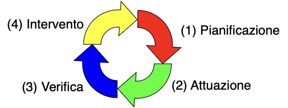

Il termine "ciclo" vuole enfatizzare la ripetitività delle fasi che si devono continuamente ripetere durante tutta la vita dell'azienda.

L'adozione di un ciclo di pianificazione e controllo è il primo passo per mantenere attuale il Sistema Informativo minimizzando i rischi di **incoerenza** e i **costi di realizzazione**.

Questo ciclo serve per non investire in scelte sbagliate.

### 1. Fase di pianificazione

Nella fase di pianificazione si collocano:

- La **formalizzazione delle strategie** in termini di servizio e di utilizzo delle tecnologie
- La **scelta delle priorità** nell'attuazione dei vari interventi di automazione
- La **validazione dei progetti** da attivare
- La **definizione degli impegni e delle risorse** necessarie. L'azienda diventa responsabile del progetto e deve portarlo avanti con certi tempi e certi costi.
- La **stesura del documento di piano** e la correlata definizione del budget e delle responsabilità. Stabilisce target, obiettivi, budget, etc.

Il nostro ciclo di innovazione è sincronizzato con quello di budgeting che si fa solitamente a frequenza annuale. Non è così in oriente, in Giappone in particolare.

### 2. Fase di realizzazione/attuazione

Nella fase di realizzazione si collocano:

- L'elaborazione di **studi di fattibilità**. Lo studio serve a capire se il progetto deve o meno essere portato avanti.
- La **definizione di progetti esecutivi** e di piani operativi
- L'**acquisizione di prodotti e servizi dal mercato**
- La **realizzazione dei progetti**
- La **conduzione operativa dei sistemi**

I progetti vengono messi in atto, quindi devo capire queli sono le tecnolgie per farlo, con chi fare il contratto per avere quelle tecnologie, arrivano quindi i consulenti, etc.

### 3. Fase di verifica

Nella fase di verifica si collocano:

- La **gestione dei progetti** nelle loro varie componenti
- La **raccolta di informazioni** sullo stato dei processi di servizio
- La **diagnosi di servizi e processi**
- La **raccolta di informazioni** sullo stato dei sistemi informativi automatizzati
- La **diagnosi della risorsa informazione**
- La **diagnosi dei sistemi informatici**

Raccolgo informazioni sullo stato dei processi che sono stati messi in atto e faccio una diagnosi evidenziando i problemi con dialogo e numeri tecnici. La tecnologia è adeguata?

Quindi dopo la raccolta di informazioni capisco quali sono lecriticità e capisco quali sono le innovazioni attraverso le quali possono essere risolte diverse problematiche. Sono momenti critici perchè tutto il gruppo dei sistemi informativi è a lavoro per capire come portarsi a casa i progetti in base al budget.

### 4. Fase di intervento

Nella fase di intervento si collocano:

- L'**elaborazione degli interventi di reingegnerizzazione** dei processi di servizio
- L'**individuazione di iniziative di reingegnerizzazione dei sistemi informatici**

## Definizione degli obiettivi

Per assicurare il raggiungimento degli obiettivi proposti è necessario che questi vengano individuati esattamente e formalizzati in modo da stabilire responsabilità, tempi e priorità.

A tale scopo ogni azienda redige il **piano di informatizzazione** che riassume la strategia con gli obiettivi di ingegnerizzazione:

### Piano strategico

Copre normalmente dai 3 ai 5 anni. È necessario per dare unitarietà alle specifiche iniziative evitando di costruire sistemi frammentati, incoerenti e tecnologicamente incompatibili.
Serve farlo ogni lasso di tempo abbastanza lungo perchè serve tempo per il completamente, in un anno non possono essere chiuse delle trasformazioni di rilievo.

Contiene:

- Obiettivi strategici dell'informatizzazione
- Architetture tecnologiche e applicative come quadro di riferimento complessivo
- Progetti di grande rilievo che richiedono elevati tempi di realizzazione e risorse

### Piano operativo

Ha validità annuale e definisce in maniera dettagliata gli interventi previsti dal piano triennale per l'esercizio in corso. Definisce chi fa cosa e quando.

Le correzioni agli obiettivi devono essere valutate continuamente:

- Aggiungendo a ogni piano operativo degli elementi correttivi che incidono sul piano strategico
- Producendo annualmente un **piano strategico a scorrimento** ma mantenendo sempre un orizzonte di 3 anni.

### Definizione degli obiettivi: top down VS bottom up

Ci vuole sempre attenzione all'aspetto metodologico anche alle persone.

**Top down**: Partendo dagli obiettivi strategici dell'organizzazione si definiscono le caratteristiche generali del sistema informativo. E' quindi il manager che decide.

- Maggiormente innovativo e discontinuo
- Permette di identificare e pianificare soluzioni che rispondono a necessità di mutamenti radicali
- Causa maggiori tensioni e rischi organizzativi perchè le persone non si sentono partecipi al cambiamento e quindi più restii ad accettarlo.

**Bottom up**: Partendo dalle indicazioni delle diverse unità organizzative. Raccolto quindi informazioni da tutti i dipendenti.

- Maggiormente conservativo, le persone che lavorano nei processi hanno una visione molto limitata perchè ognuno racconta la sua storia. Non molto innovativi.
- Difficilmente riesce a produrre ipotesi di innovazione radicale
- Presenta scarsi rischi realizzativi

Possiamo avere un approccio ibrido perchè i due approcci sono gli estremi, cercando di avere il meglio delle due metodologie.

**Approccio ibrido** (più diffuso):

1. Individuazione e diffusione delle strategie generali di evoluzione
2. Richiesta alle diverse unità dell'organizzazione di elaborare una loro proposta specifica
3. Integrazione delle varie proposte con verifica della coerenza globale
4. Definizione degli interventi infrastrutturali e definizione del piano finale

## Il percorso di adozione nei Sistemi Informativi

Il percorso di digitalizzazione è incrementale e raramente permette di saltare dei passaggi.

È **rischioso, costoso e inutile** adottare soluzioni avanzate senza avere completamente sfruttato quelle semplici perché:

- I manager non sono pronti (non hanno il mindset giusto), non sanno sfruttare le innovazioni tecnologiche.
- I dati non sono pronti (non sono di qualità sufficiente per un certo livello di digitalizzazione)
- I processi delle aziende non sono pronti, non sono definiti in modo da appoggiarsi ai dati e di reagire a essi

Dobbiamo quindi considerare sempre gli elementi esterni al sistema che sono le persone e anche i materiali che l'azienda utilizza.

**Dubitate dei consulenti e dei fornitori di software che offrono analisi avanzate se la vostra azienda sfrutta a malapena un foglio Excel**

## Creare aziende data-driven

Il termine **aziende data-driven** si riferisce ad aziende in cui le decisioni e i processi sono supportate dai dati:

- Le decisioni si basano su conoscenze quantitative piuttosto che qualitative
- I processi e le conoscenze sono una risorsa dell'azienda e non vanno persi se i manager cambiano

Anche solo i manager hanno a disposizione dei dati questo cambia molto perchè possiamo ragionare su cose oggettive e non solo sull'esperienza.

**La differenza tra una decisione basata sui dati e una buona decisione è un buon manager**

L'adozione di una mentalità basata sui dati comporta:

- Creare una cultura dei dati
- Cambiare la mentalità dei manager
- Cambiare i processi
- Migliorare la qualità di tutti i dati

### Le tre dimensioni della digitalizzazione

Passare da A a B è un processo pluriennale fatto di obiettivi intermedi, ciascuno dei quali deve essere raggiungibile:

- Deve risolvere un problema e apportare valore
- Deve essere realizzabile in un intervallo di tempo limitato (in genere meno di un anno)
- I costi devono essere economicamente correlati agli utili
  ...

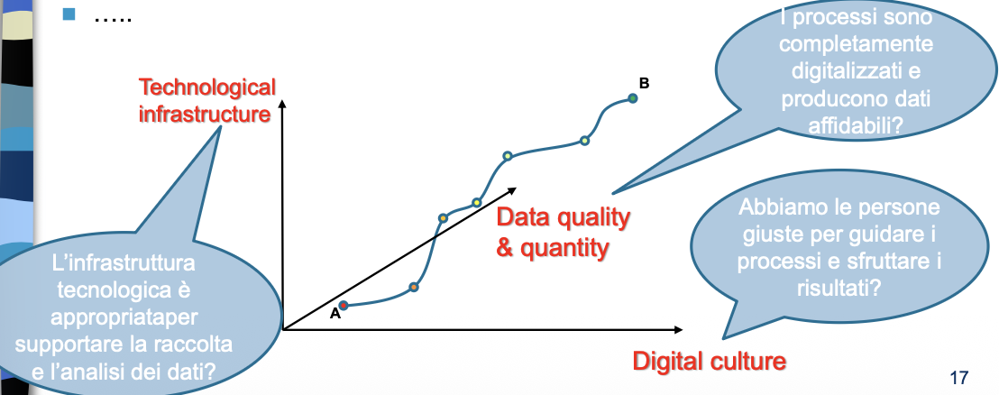

Ogni passo del progetto deve essere giustificato

**Digital culture**: Abbiamo le persone giuste per guidare i processi e sfruttare i risultati?

**Data quality & quantity**: I processi sono completamente digitalizzati e producono dati affidabili?

**Technological infrastructure**: L'infrastruttura tecnologica è appropriata per supportare la raccolta e l'analisi dei dati? (potenza di calcolo ad esempio)

## Il miglioramento incrementale

Il miglioramento si ripete nel tempo.

### Approccio occidentale vs. approccio giapponese

- **Approccio occidentale**: Il miglioramento discontinuo perchè abbiamo un miglioramento annuo
- **Approccio Giapponese**: Il miglioramento continuo, abbiamo anche passo settimanali

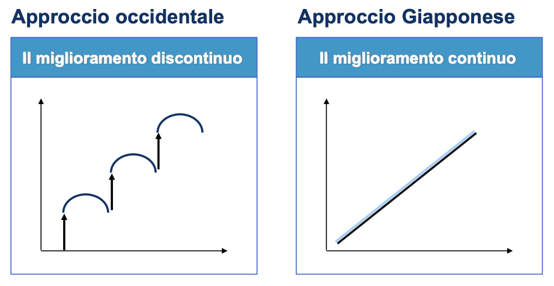

### Perché il miglioramento incrementale non basta

Il miglioramento continuo non basta a eliminare il gap tra la percezione del valore da parte del cliente e ciò che offre l'azienda rispetto ai leader del settore.

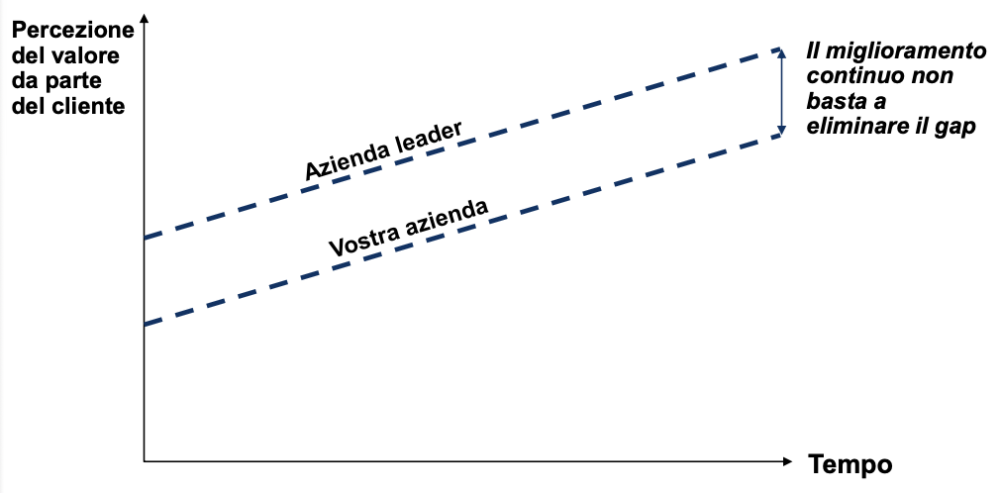

## Il Business Process Reengineering

Il miglioramento incrementale non sempre basta quindi ogni tanto abbiamo la necessità di adottare cambiamenti rivoluzionari (reingegnerizzazione ex novo) per fare un salto dal cambiamento lento.

Il **BPR** (Business Process Reengineering) nasce come completo ripensamento e radicale ridisegno dei fondamentali processi di un'organizzazione alla luce delle potenzialità offerte dai nuovi strumenti informatici.

L'accento è sulla discontinuità, sul salto nelle prestazioni, sulla completa assenza di vincoli di riprogettazione.

Quindi dobbiamo ripensare completamente con le possibilità che il sistema ci mette a dispozione. Se riusciamo abbiamo un salto di performance (Breakthrough).

Il concetto di B.P.R. nasce agli inizi degli anni '90 per impulso di Michael Hammer:

_"... It is time to stop paving the cow paths. Instead of embedding outdated processes in silicon and software, we should obliterate them and start over. We should "reengineer" our businesses: use the power of modern information technology to radically redesign our business processes in order to achieve dramatic improvements in their performance."_

## I processi aziendali

**Processo**: insieme delle attività tra loro interrelate, finalizzate alla realizzazione di un risultato definito e misurabile che contribuisce al raggiungimento della missione dell'azienda.

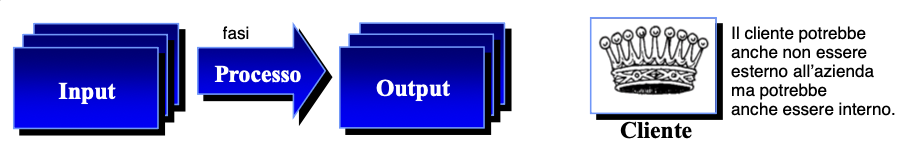

Il **cliente** è la persona o gruppo che richiede o usa un prodotto o servizio realizzato tramite il processo. Non per forza è un cliente dell'azienda ma anche un cliente interno all'azienda quindi un processo interno ha necessità di fornire un materiale alla produzione ad esempio, o al magazzino.

Il processo e la sua "manutenzione" diventano gli elementi centrali del ciclo di innovazione dei SI.

Primo compito del progettista è quello di **descrivere e classificare i processi**:

- Le classificazioni normative descrivono la struttura dei processi come dovrebbe essere (best practice)
- Le classificazioni normative vengono mappate nei principali pacchetti software
- Le classificazioni normative forniscono una informazione della situazione "to be"

### Cos'è il Business Process Re-engineering

Il BPR è la completa revisione dei processi aziendali al fine di massimizzarne il valore derivante dalle singole componenti, attraverso interventi sia di riduzione dei costi sia di massimizzazione dell'efficacia. **Il BPR può essere innescato da un aggiornamento tecnologico**.

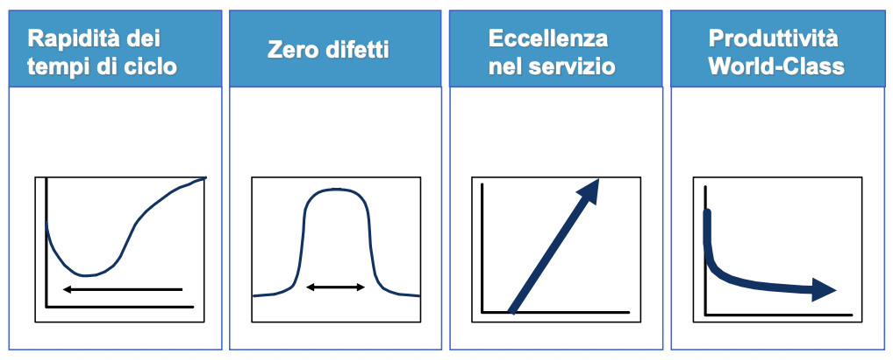

Lo Streamlining è un cambiamento (piccolo) continuo che va a migliorare il processo.
Il Re-engineering significa cambiare un processo radicalmente ma mantenendo lo stesso prodotto e servizio che forniamo con quel processo. **Nuovi processi a parità di prodotto**.
La Trasformazione è quando decido di fare anche prodotti differenti. Ad esempio la BMV che faceva veicoli militari, dopo la guerra e il divieto alla Germania di prodirne altri hanno deciso di spostare il prodotto producendo veicoli non militari. Utilizzo quindi la mia conoscenza per fornire ai clienti (diversi) un prodotto nuovo.

Obiettivi:

- **Rapidità dei tempi di ciclo**
- **Zero difetti**
- **Eccellenza nel servizio**
- **Produttività World-Class**

### Gli approcci di miglioramento

Il Business Process Reengineering permette di realizzare "il salto di qualità" (Breakthrough) combinando:

- Miglioramento continuo
- Miglioramento discontinuo
- BPR

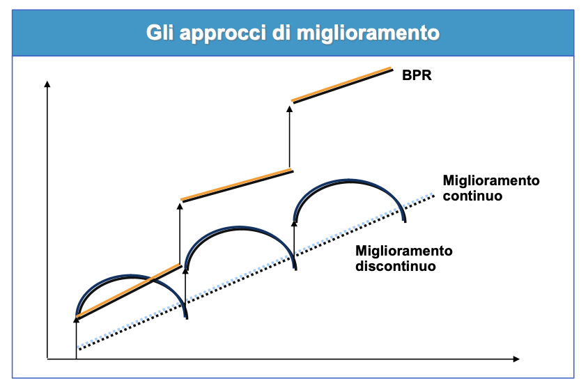

## Le varie modalità di reingegnerizzazione

Variano in funzione dello scopo e dell'ampiezza del cambiamento:

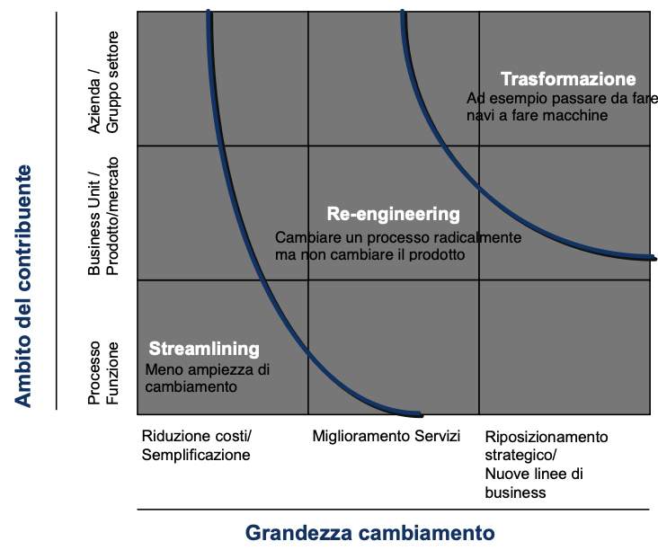

### Streamlining

- **Ambito**: Processo/Funzione
- **Grandezza cambiamento**: Riduzione costi/Semplificazione
- **Approccio**: Incrementale sui processi
- **Focus**: Pianificare il presente

### Re-engineering

- **Ambito**: Business Unit / Prodotto/mercato
- **Grandezza cambiamento**: Miglioramento Servizi
- **Approccio**: Radicale sui processi
- **Focus**: Pianificare il futuro a parità di business

### Enterprise Transformation

- **Ambito**: Azienda / Gruppo settore
- **Grandezza cambiamento**: Riposizionamento strategico/Nuove linee di business
- **Approccio**: Radicale sul business
- **Focus**: Pianificare il business

## Fasi del BPR

1. **Identificazione dei processi da reingegnerizzare**

   - 1.1 Descrivere i processi
   - 1.2 Identificazione del breakthrough
   - 1.3 Analisi dei tempi di ciclo
   - 1.4 Analisi della creazione del valore

2. **Definizione delle priorità di intervento** sulla base del loro impatto

   - Analisi di Pareto

3. **Reingegnerizzazione dei processi** per rimuovere le barriere alla performance

4. **Implementazione del cambiamento**

5. **Istituzionalizzazione delle misure** per il miglioramento continuo

### 1.1 Descrivere i Processi

La scomposizione dei processi dettaglia i processi per successivi livelli di approfondimento:

- Macroprocesso: ne è un esempio la catena del valore di Porter. È utile soprattutto nelle fasi iniziali per strutturare l'analisi e per individuare l'area di intervento.
- Processo: Illustra a un livello ragionevolmente dettagliato le operazioni svolte da un'azienda.
  _Esempio: Il macroprocesso "Sviluppo prodotti" si decompone in: "Concept" – "Pianificazione" – "Progettazione" – "Prototipazione" – "Test" – "Ingegnerizzazione"_
- Fase: Ha lo scopo di descrivere il modo in cui un processo è implementato. Una fase è una tappa di un processo.
  _Esempio: Il processo "Progettazione" comprende le fasi di: "Sviluppo specifiche" – "Gestione del concurrent engineering" – "Realizzazione del value engineering" – "Documentazione delle specifiche di progetto" – "Sviluppo prototipi" – "Gestione delle richieste di brevetto"_
- Attività: È il livello adottato nella fase di studio dei processi. Sono determinate scomponendo ulteriormente le fasi secondo una logica sequenziale.

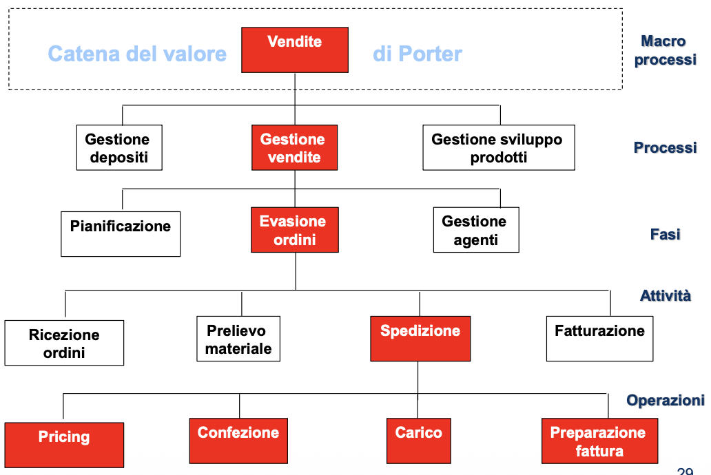

**Note**:

- _Concurrent engineering_: Approccio sistematico alla progettazione che considera contemporaneamente tutti gli aspetti del ciclo di vita
- _Value engineering_: Analisi delle caratteristiche di un prodotto/servizio per migliorarne efficacia, affidabilità, qualità, sicurezza e costo

#### Le variabili di progettazione dei processi (Descrivere i processi)

- **Flusso delle attività**: Sequenza di attività attraverso cui il processo è svolto. Può essere modellato con Activity Diagram (UML). Oppure ci sono anche altri diagrammi come il DFD (Data flow diagram). Definisco i legami tra le attività.

- **Organizzazione del processo**: Sia dal punto di vista della suddivisione operativa del lavoro, sia della struttura di coordinamento e controllo aziendale. Il legame può essere modellato mediante Linear Responsability Charting (LRC) mi dice quindi chi fa cosa.

- **Competenze delle risorse umane**: La cui adeguatezza è condizione fondamentale per la trasformazione

- **Sistema di misurazione e controllo delle prestazioni**: Necessario per governare il processo. Viene realizzato tramite sistemi di Key Performance Indicator (KPI) o di Balanced Scorecard. Mi devo creare degli indicatori numerici che mi dicano qualcosa sul processo, quindi delle feature che mi descrivano il processo.

Nota: il risultato non è solo il diagramma ma anche lo sforzo che c'è dietro di essi. Non ci dà una verità implementabile ma ci permette di capire e ragionare su un certo ambito e un certo processo.

---

## Linear Responsability Charting (LRC)

Determina una visione tabellare della responsabilità organizzativa che integra quella dell'organigramma, specificando il **ruolo** delle varie strutture nel processo considerato.

L'idea è capire su ogni attività (riga) quali sono i soggetti che interagiscono.

Si ottiene incrociando le attività del processo con le divisioni. Il ruolo è indicato dalle etichette:

- **D** = decide, autorizza, ratifica
- **E** = esegue
- **A** = partecipa a tempo parziale, fornisce assistenza operativa e supporto
- **I** = è sistematicamente informato

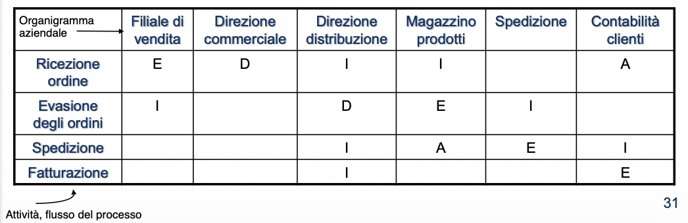

## Le risorse umane

Deve tarare i processi in base alle conoscenze che hanno i dipendenti.

- Le risorse umane determinano la differenza tra il risultato effettivo e il massimo teoricamente possibile
- Le tecnologie innovative necessitano di figure professionali che non esistono in azienda
- Il reperimento può essere costoso e complesso
- La formazione degli utenti pone molti problemi gestionali:
  - Gli utenti devono superare l'avversione al cambiamento
  - I vantaggi delle nuove soluzioni non sono subito evidenti
  - Il rischio maggiore è introdurre un cambiamento maggiore delle capacità individuali di adattamento

Se io ho bisogno del personale di una specifica tecnologia, la facilità di trovarla è proporzionale alla diffusione della tecnologia stessa (curva rossa nell'immagine). Quindi oggi molte aziende informatiche sono orientate al lavoratore specializzato e non più al clienti.

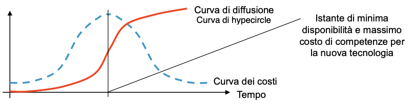

## Key Performance Indicator (KPI)

Per verificare l'efficacia del processo è necessario misurare quantitativamente come questo soddisfa i requisiti del cliente. Ogni processo ha dei requisiti da rispettare e dobbiamo capire come misurarli e cosa cerchiamo.

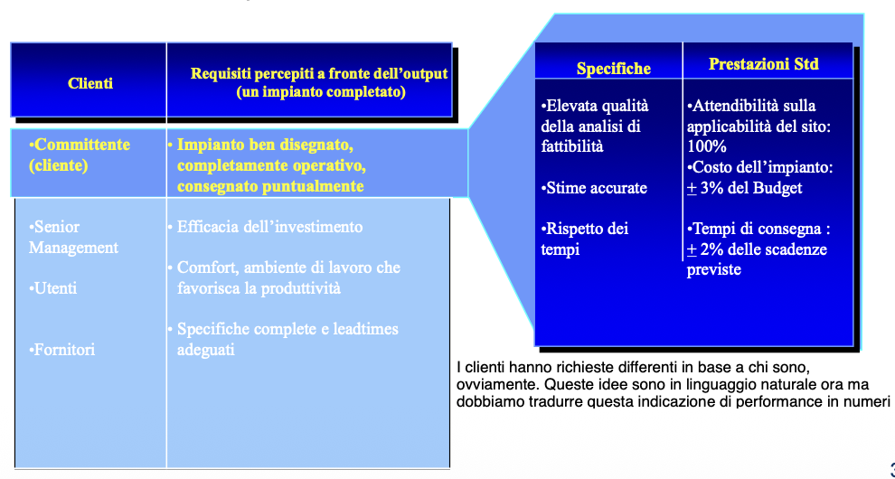

Un **KPI** è un indicatore quantificabile dell'efficacia e/o dell'efficienza di un processo o di un sottoprocesso.

Questo tipo di indicatori sono anche nei contratti, pensiamo ad un contratto di fibra in cui l'azienda che lo fornisce definisce delle specifiche tecniche che è ritenuta a ripsettare (es: velocità).

Costruire un KPI vuol dire partire da una caratteristica qualitativa del prodotto e tradurre questa in un valore quantitativo.

Caratteristiche di un KPI:

- È quantificabile dell'efficienza e efficacia. Calcolabile con una formula.
- È rilevabile
- È correlato con l'obiettivo di business interno di processo

Esempio: Ho un supermercato e devo capire l'assortimento. La mia capacità descritta a parola è quella di massimizzare la vendita, riempire il superemercato e far tornare il cliente.

Studio il flusso dell'attività: classifico i clienti (quante famiglia e quanti single), guardo il mercato, capisco i macroassortimenti che possono servire ai clienti, definisco i microassortimenti (quanti tipi di carta igienica voglio avere), capisco come organizzo il supermercato.

Quali possono essere i miei indicatori che mi dicono se ho i prodotti giusti nella quantità giusta?

1. io devo avere persone che mi comprano i prodotti ad una certa velocità e quantità nel tempo (se mi rimane ne ho preso troppo, se finisce spesso ne ho preso troppo poco)
2. le fidelity card sono molto utili a capire quante volte il cliente torna. Ad esempio Zara ha delle tecniche di rinnovamento che porta le persone a tornare molto spesso.

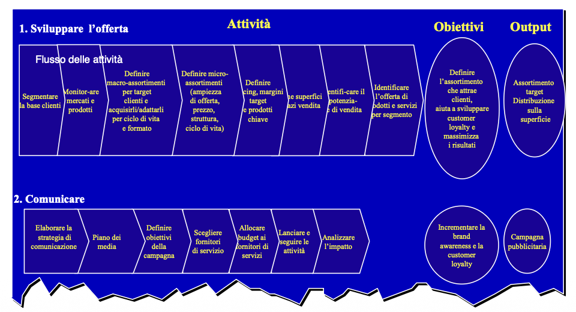

### Proprietà dei KPI

- **Significatività**: Collegamento con gli obiettivi strategici

- **Controllabilità**:

  - Misurazione di risultati che possono essere influenzati
  - Focalizzazione su un ben definito periodo di tempo

- **Semplicità**:

  - Facilità concettuale
  - Pochi indicatori sono preferibili a una metrica complessa

- **Misurabilità**:

  - Disponibilità dei dati
  - Affidabilità e accuratezza dei dati

- **Equilibrio**:

  - Collegamento degli **indicatori tecnici** (ex-ante) con le attività
  - Collegamento degli **indicatori di risultato** (ex-post) con gli obiettivi e gli output

Gli **indicatori di risultato** misurano la performance a un momento dato, mentre gli **indicatori tecnici** misurano attività che influenzano la performance.

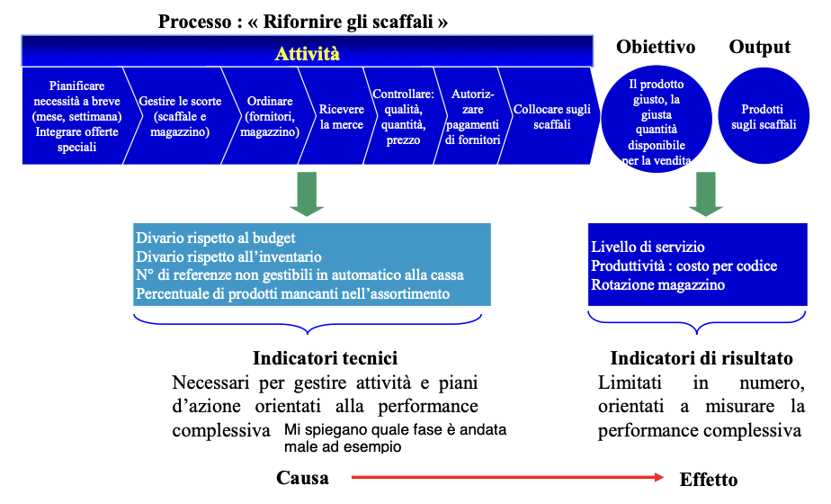

### La mappa degli indicatori

Per misurare efficacemente un fenomeno è necessario definire una mappa integrata di KPI che copra diversi punti di vista a diversi livelli di dettaglio. Ovviamente perchè avere un solo indicatore non basta ma è molto più utile avere per ogni aspetto da identificare un indicatore a sè.

La mappa deve chiarire:

- **Fenomeno da misurare**: Il processo o il soggetto da valutare
- **Obiettivi**: Quale scopo deve raggiungere il processo
- **Misure**: Identificazione concreta ma ancora qualitativa degli aspetti da monitorare
- **Stakeholder**: Soggetti interessati ai KPI
- **Sorgente dati**: Determina l'effettiva calcolabilità dell'indicatore
- **Formulazione**: Specifica la formula di calcolo dell'indicatore

### Visualizzazione di KPI

Gli **indicatori di Sant'Anna** sono una mappa di centinaia di indicatori finalizzati a valutare le performance della sanità pubblica.

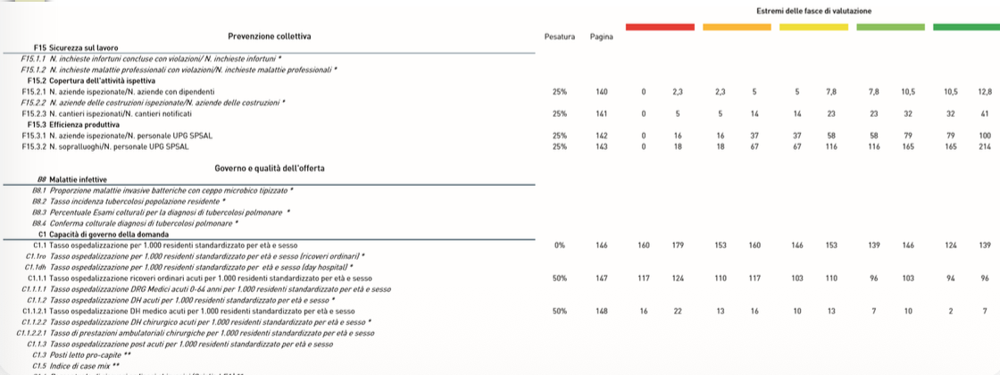

Tecniche di visualizzazione:

- **Scatter plot**: Evidenzia i trend di miglioramento e peggioramento. Se sono nella parte in alto a sinistra allora sto migliorando.

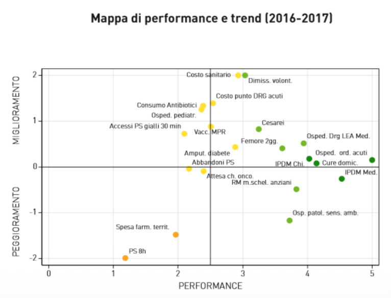

- **Bersaglio**: Evidenzia graficamente la performance su gruppi omogenei e disomogenei di KPI. Più il pallino bianco è vicino al centro e più sono bravo.

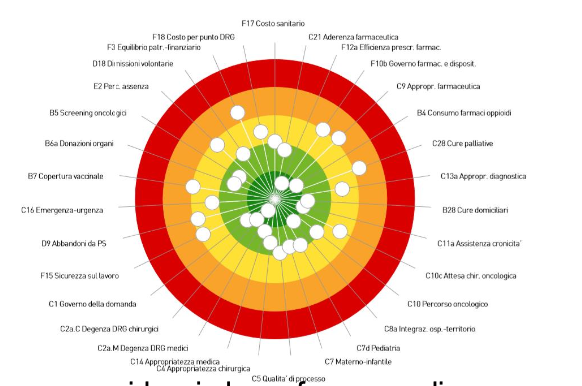

- **Pentagramma**: Evidenzia la performance di un processo. Ho 5 livelli.

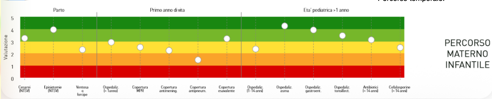

## Overall Equipment Effectiveness (OEE)

**OEE** è il principale KPI per misurare la capacità di produzione di un'azienda manifatturiera. È spesso usato nella Lean Manufacturing per raggiungere l'eccellenza operativa.

### Formula

**OEE = Availability × Performance × Quality**

- **Availability** [0;1]: Percentuale di tempo lavorato rispetto al tempo disponibile. Se io ho una macchina che viene utilizzata in 8 ore di turno ma la uso solo per 4 ore allora è 0.5.

- **Performance** [0;1]: Percentuale di pezzi effettivamente lavorati rispetto ai pezzi teoricamente lavorabili. Dato il tempo a sua disposizione doveva fare 54 pezzi ma ne ha fatti solo 48.

- **Quality** [0;1]: Rapporto percentuale dei pezzi conformi sul totale dei pezzi prodotti. Quanti dei pezzi che ho prodotto hanno superato il controllo qualità.

Il calcolo dettagliato/automatico dell'OEE richiede **SCADA** e **MES**. Senza un sistema automatizzato non si riesce a misurare.

### OEE Example

Dati di produzione:

- Planned batch: 5.300 pezzi
- Theoretical processing time: 87 secs/pezzo
- Working shifts: 3 × 8h per day, 5 days/week
- Theoretical working time: 16,01 working shifts

Fermi macchina:

- Machinery set up (primo turno): 90 mins
- Weekly start up (lunedì): 35 mins
- Manual checks: 24 mins
- 12 alarms: 28 mins

**Availability OEE** = (480-90-35-24-28) / 480 = **63%**

Risultati completi:

- **Availability OEE**: 71%
- **Performance OEE**: 93%
- **Quality OEE**: 97%
- **Working Shift OEE**: **64%**

## Costruiamo una mappa di KPI - Training

Lezione di training con un eserizio. Le slide di riferimento sono "monitoring the timetable problem" e "Assortment Analysis".

### Esempio 1

Problema: costruzione dell'orario delle lezioni. Ogni anno l'università deve affrontare il problema di pensare all'orario delle lezioni per ogni corso di laurea.

Persone coinvolte:

1. Docenti
2. Segreteria (quella che decide) insieme alla commissione d'orario (da noi è un docente che è Ferrara) di ogni corso di laurea coinvolto
3. Studenti che devono essere informati

Informazioni importanti (variabili)

1. Corsi
2. Capienza aule e laboratori

Flusso di attività:

1. Quindi prendo le informazioni sui corsi e le aule e li colleziono
2. cerco di capire quali sono i docenti e i vincoli dei docenti dividendo su vincoli hard che devono essere rispettati per forza e vincoli soft che possono essere delle richieste che si tende a rispettare ma che possono venire a meno. Ad esempio: se un docente ha due corsi non posso sovrapporre i due corsi (hard), se un docente deve venire da Bologna allora preferisce iniziare alle 11 per non dover prendere il treno troppo presto (soft)
3. Si produce un prospetto di orario e viene mandato ai docenti e al direttore del corso di laurea che vede vedere se tutti i vincoli vengono rispettati
4. Si va quindi in aula con quello ma ci sono dei corsi che di anno in anno possono cambiare. Ad esempio gli studenti si accorgono che in molti vogliono seguire due corsi facoltativi che sono in contemporanea quindi possono chiedere di modificare gli orari.
5. Si fanno quindi le modifiche e poi di nuovo il giro ai docenti and co.

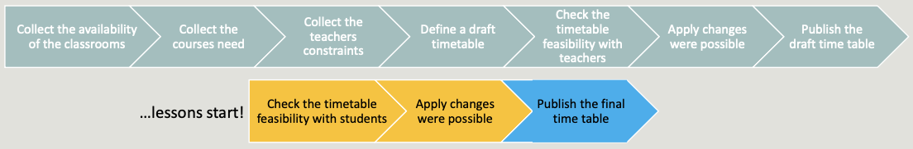

Facciamo quindi una bella tabella un cui si mettono sulle righe le persone coinvolte e nelle colonne le attività da fare e vediamo per ogni attività quale persone devono partecipare, approvare o eseguire quella specifica cosa.

Come facciamo a capire se le varie attiivtà sono andate a buon fine? Prima cerco di capire le qualità che voglio andare a vedere nell'orario che ho fatto.

1. Carico giornaliero bilanciato (9 ore di lezione sarebbero impossibili da seguire).
2. Mancanza di sovrapposizione
3. Soddisfacimento delle richieste dei docenti (vincoli soft)

Come posso passare da queste qualità a degli indicatori numerici?

2.Indicatore per: Mancanza di sovrapposizione

Per capire come misurare la sovrapposizione prima mi chiedo: cosa stiamo a identificare come sovrapposizione? Diciamo che due lezioni sono sovrapposte se due lezioni dello stesso corso di laurea e dello stesso anno sono dello stesso orario.

Quindi l'indicatore che posso definire:

--> il numero di ore di sovrapposizione / le ore totale dei corsi = percentuale di sovrapposizione
--> Alla foruma aggiungo un indicatore di severità della sovrapposizione (overlap)

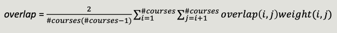

### Esempio 2

Caso di studio: La Teddy di Rimini fa un progetto per i suoi negozi di abbigliamento per ottimizzare le quantità da mandare di prodotto ai diversi negozi per non mandare troppo o troppo poco prodotto perchè altrimenti per rinviarli indietro si andavano a spendere soldi inutilmente. L'azienda ha quindi bisogno di indictori specifici che mi aiutano a capire.

Considerazioni:

- I prodotti non esposti non sono venduti. Se il negozio è troppo pieno non posso esporre nuovi prodotti.
- Se ho troppi pochi prodotti in esposizione e in diversi lo provano allora non ce ne sono più in esposizione.
- Avere sempre gli stessi articoli nel negozio non attrae la clientela a tornare dopo poco tempo.

Il negozio ha due magazzini: uno è l'esposizione e uno nel negozio per il ricambio dei prodotti. Ogni giorni faccio un'immagine del magazzino per capire cosa ho e cosa non ho.

Chi se ne occupa:

- Category manager (responsabile di una categoria di prodotti)
- Supervisor che guardo per i diversi paese la moda che c'è
- Layout manager che gestisce in che modo gestire l'esposizione delle diverse categorie

Vediamo quali sono i criteri da voler analizzare:

- Tempo di esposizione
- Quanto sono vicino al numero ottimale di prodotto
- Dopo quanto si rinnova l'esposizione
- Quanti articoli sono esposti in ogni metro quadrato

## Fasi del BPR (Business Process Reengineering)

1. Identificazione dei processi da reingegnerizzare
   --> Descrivere i processi
   --> **Identificazione del breakthrough**
   --> **Analisi dei tempi di ciclo**
   --> **Analisi della creazione del valore**

2. Definizione delle priorità di intervento

3. Analisi di Pareto

4. Reingegnerizzazione dei processi
   --> Rimuovere le barriere alla performance

5. Implementazione del cambiamento

6. Istituzionalizzazione delle misure per il miglioramento continuo

## L'identificazione dei Breakthrough

Esistono dei livelli di performance di un processo (in termini di costo, qualità, servizio o tempi di ciclo) il cui raggiungimento comporta un miglioramento significativo e più che proporzionale dei benefici.

**Rappresentazione grafica**: Il breakthrough è il punto di inflessione dove l'economic gain accelera significativamente rispetto al time investito.

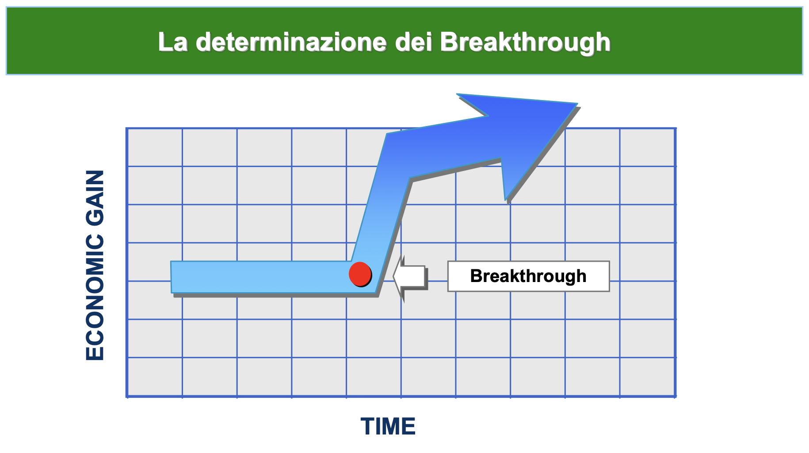

### Due modalità fondamentali per l'identificazione dei Breakthrough

**1. La "voce del cliente" (VoC)**

È un processo sistematico attraverso il quale un'azienda raccoglie, interpreta e comprende le opinioni, le aspettative e le esperienze dei propri clienti riguardo a prodotti, servizi o brand.

**Metodi di raccolta**:

- **Sondaggi e questionari**: feedback diretti dai clienti
- **Interviste**: incontri faccia a faccia o telefonici
- **Social media e recensioni online**: monitoraggio opinioni digitali, sempre molto più diffuso quindi tutte le grandi aziende lanciano delle analisi dei social.
- **Focus group**: discussioni con clienti selezionati
- **Analisi dei dati di supporto clienti**: richieste e problematiche

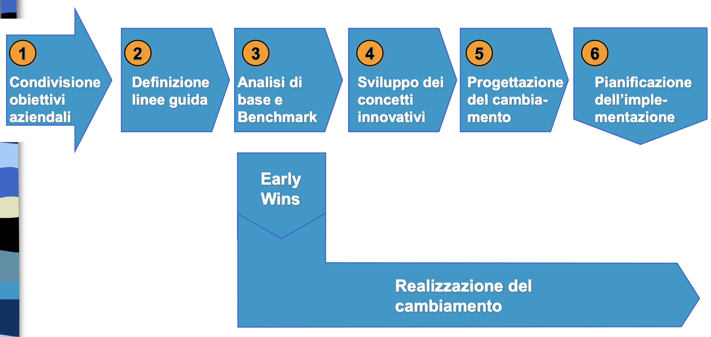

**Il cliente va inteso come**:

- Cliente finale
- Cliente interno (di un processo)
- Stakeholder della supply chain

**Conseguenze di non includere la VoC in un progetto BPR** (se non ascolto il mio cliente):

- Rischio di non offrire ciò che il cliente vuole quando lo vuole
- Possibile perdita di posizionamento e clienti chiave
- Rischio di focalizzare il BPR su aree non a valore per il cliente
- Ambiente di lavoro stressante fra i clienti interni

**2. Il Benchmarking**

Il benchmarking è un processo di comparazione attraverso il quale l'organizzazione compara le performance interne con standard esterni di eccellenza.

**Caratteristiche**:

- Utilizza i KPI per quantificare la prestazione
- Obiettivo: ottenere e mantenere una performance best-in-class
- L'osservazione dell'approccio di altre organizzazioni può catalizzare soluzioni innovative
- Può accelerare notevolmente un processo di cambiamento con un'efficacia di comunicazione considerevole

## Tecniche BPR: l'analisi dei tempi ciclo

L'analisi dei tempi di ciclo (cycle time analysis) è una tecnica utilizzata per misurare e ottimizzare l'efficienza dei processi produttivi o operativi, analizzando il tempo necessario per completare un ciclo di lavoro.
L'analisi cerca di capire se ci sono delle attività che prendono troppo tempo e che quindi vanno modificate.

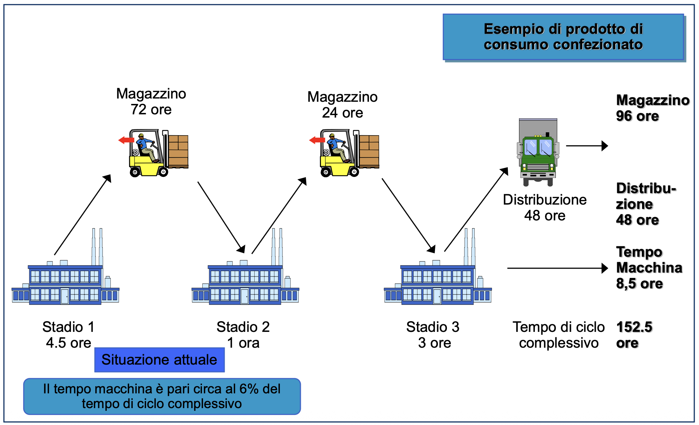

### Componenti del tempo di ciclo:

1. **Tempo di lavorazione (Processing Time)**: tempo effettivo dedicato alla realizzazione dell'attività o del prodotto. Unico tempo utile.

2. **Tempo di attesa (Waiting Time)**: tempo durante il quale il lavoro è in attesa tra una fase e l'altra

3. **Setup Time**: tempo richiesto per preparare una macchina o un processo prima di iniziare il lavoro

4. **Tempo di movimentazione (Transport Time)**: tempo impiegato per spostare materiali o informazioni da una fase all'altra

5. **Tempo di inattività (Idle Time)**: periodi in cui risorse o macchine non vengono utilizzate

### Obiettivi dell'analisi:

- Identificare colli di bottiglia
- Ridurre i tempi morti
- Ottimizzare le risorse
- Aumentare l'efficienza complessiva

### Esempio: Analisi dei tempi ciclo - Caso Utilities

**Contesto**
Processo di fatturazione di un'azienda che commercializza energia elettrica:

- La fatturazione è posteriore al periodo di erogazione
- Il processo può iniziare solo dopo il termine del periodo di consumo
- Il calcolo è complicato per l'elevato numero di contratti/offerte variabili
- **Ogni ritardo determina una perdita finanziaria** (pagamenti a X giorni data fattura)
- L'azienda era passata da poche centinaia a decine di migliaia di clienti in 3 anni
- Tempi di fatturazione: 4-5 giorni. Dobbiamo cercare di ridurre questa latenza perchè l'azienda per 5 giorni non possedeva milioni di euro per un ritardo nel tempoo di fatturazione.

**Fasi del processo:**

1. **Raccolta dati di consumo (SCADA)**

   - Lettura contatori (smart meter o manuali)
   - Eventuali stime

2. **Validazione e normalizzazione dati (ERP)**

   - Controlli di coerenza
   - Correzioni o rettifiche

3. **Calcolo del consumo fatturabile (ERP)**

   - Determinazione kWh consumati
   - Ripartizione per fasce orarie (F1, F2, F3)

4. **Applicazione delle tariffe (ERP)**

   - Prezzo dell'energia (quota variabile)
   - Quote fisse
   - Oneri di sistema e imposte

5. **Generazione della bolletta**

   - Software generatore di PDF integrato nell'ERP.

6. **Invio della fattura al cliente**

   - Formato cartaceo o digitale (CRM)

7. **Gestione del pagamento**

   - Riconciliazione contabile

8. **Gestione post-fatturazione**
   - Solleciti e reminder
   - Eventuali rateizzazioni

### Soluzione identificata

**Problema scoperto**: L'80% del tempo era impegnato da controlli fuori sistema fatti su fogli Excel:

1. Download dei dati dall'ERP verso Excel
2. Applicazione di controlli definiti da regole
3. Verifica dati anomali (presenti in meno dello 0.1% delle fatture)
4. Correzione dei dati sull'ERP

**Opzioni considerate**:

- A. Accettare il tempo di ciclo
- B. Implementare i controlli aggiuntivi personalizzando il processo di fatturazione
- **C. Eliminare i controlli dal processo di fatturazione** ✓ (unica riposta giusta)

**Motivazione della scelta**:

- L'implementazione dei controlli sull'ERP risulta inadeguata (onerosa, ricorrente, genera lock-in)
- È stato valutato meno oneroso il rischio di emettere una fattura sbagliata su 1000 piuttosto che accettare una perdita finanziaria certa

## Tecniche BPR: l'analisi della creazione del valore

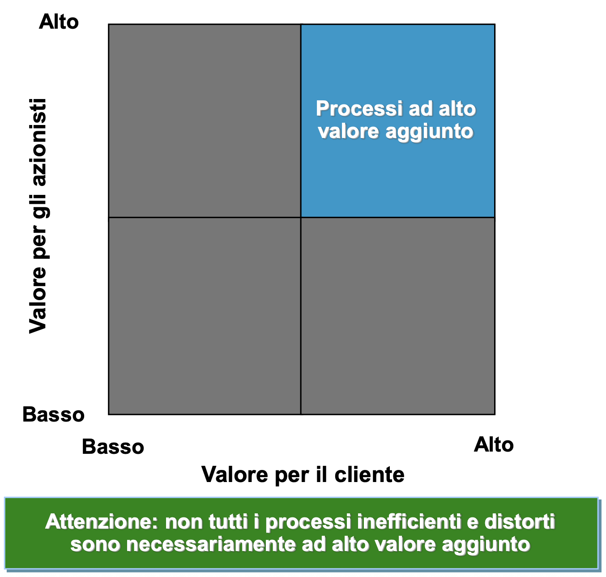

Permette di identificare le attività che "aggiungono valore al cliente" attraverso domande chiave:

### Domande per l'Analisi a valore aggiunto

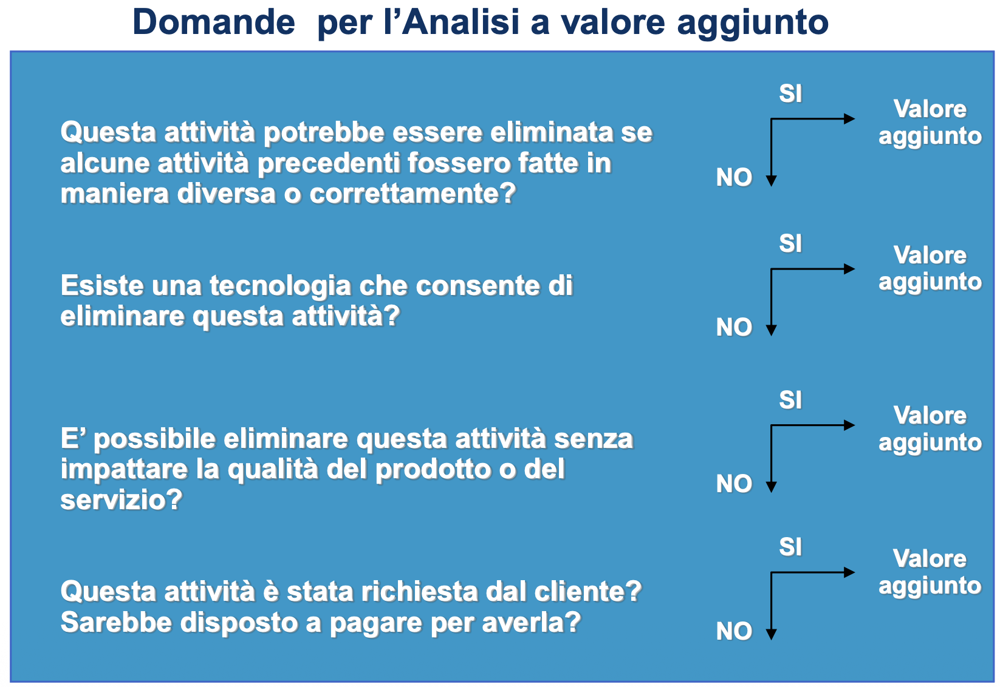

### Focalizzazione sui processi ad alto valore aggiunto

È fondamentale focalizzarsi sui processi che contribuiscono maggiormente alla creazione del valore.

**Matrice di prioritizzazione**:

- **Asse X**: Valore per il cliente (Basso → Alto)
- **Asse Y**: Valore per gli azionisti (Basso → Alto)

**Processi ad alto valore aggiunto**: Alto valore sia per il cliente che per gli azionisti

**Attenzione**: Non tutti i processi inefficienti e distorti sono necessariamente ad alto valore aggiunto.

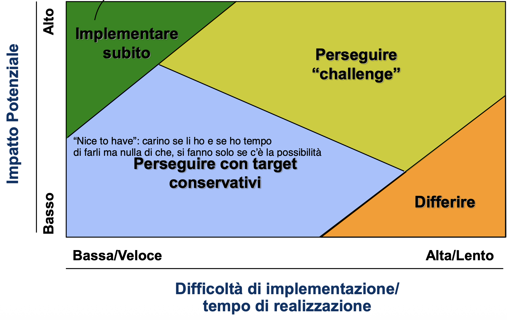

### Portafoglio dei processi - Esempio Azienda X

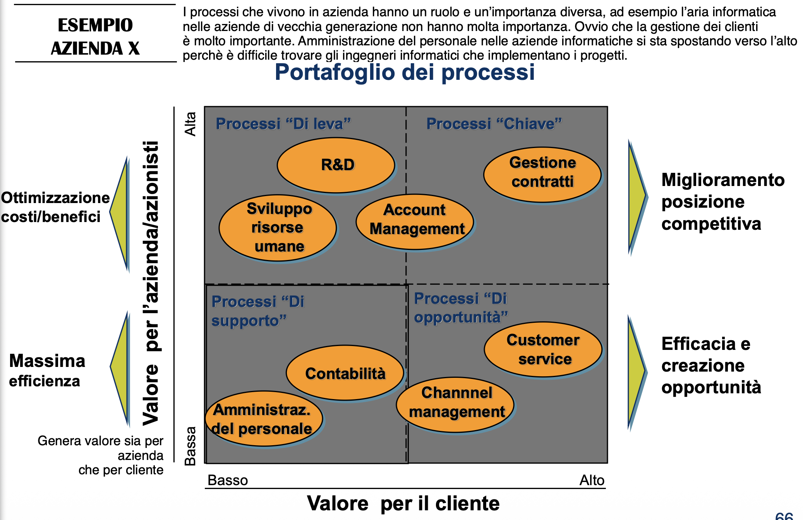

## Tecniche BPR: l'analisi di Pareto

L'analisi di Pareto è uno strumento statistico utilizzato per identificare e focalizzarsi sugli elementi che hanno il maggiore impatto su un determinato fenomeno, uno strumento di analisi che si basa sull'osservazione empirica secondo cui una minoranza di cause genera la maggioranza degli effetti.

### Principio di Pareto (Legge 80/20)

Prende il nome dall'economista italiano Vilfredo Pareto, che nel 1896 osservò che circa l'80% della ricchezza in Italia era posseduta dal 20% della popolazione. Successivamente si scoprì che questo rapporto si ripeteva in molti altri contesti. Si base su questa affermazione:

"Circa l'80% degli effetti deriva dal 20% delle cause."

### Fasi dell'analisi:

1. **Raccolta dei dati**: dati in relazione a un fenomeno o problema specifico

2. **Classificazione e ordinamento**: le categorie vengono ordinate in ordine decrescente di frequenza o impatto

3. **Creazione di un grafico di Pareto**:

   - Asse X: diverse categorie
   - Asse Y: frequenza o importanza relativa
   - Barre ordinate dalla più alta alla più bassa
   - Linea cumulativa che mostra la percentuale accumulata

4. **Identificazione del "20% cruciale"**

### Obiettivi dell'analisi:

- Evidenziare le cause principali di un problema
- Permettere di concentrarsi sulle aree che generano il maggior impatto
- Evitare di disperdere risorse su fattori meno significativi

### Esempio pratico:

**Reclami clienti** ordinati per frequenza:

1. Bassa Qualità (~130 occorrenze) - 50% cumulativo
2. Consegne in ritardo (~75 occorrenze) - 80% cumulativo
3. Errori di produzione (~45 occorrenze) - 95% cumulativo
4. Fatturazione errata (~25 occorrenze)
5. Servizio scadente (~10 occorrenze)
6. Quantità sbagliata (~5 occorrenze)

**Il diagramma illustra graficamente la regola del 80:20**: Le prime 2-3 cause rappresentano circa l'80% dei problemi totali.

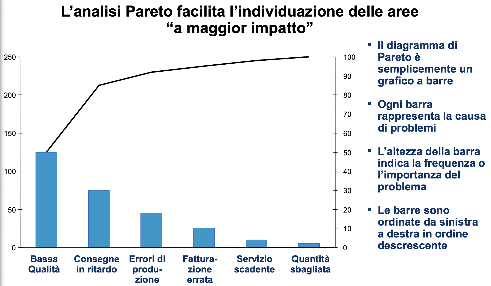

## La scelta dei processi sui quali intervenire

Deve tenere conto di:

- **Impatto potenziale**
- **Difficoltà di implementazione**
- **Tempo disponibile per la realizzazione**

### Matrice di prioritizzazione:

**Implementare subito**:

- Alto impatto potenziale
- Bassa difficoltà / Veloce realizzazione

**Perseguire "challenge"**:

- Alto impatto potenziale
- Alta difficoltà / Lento

**Perseguire con target conservativi**:

- Basso impatto potenziale
- Bassa difficoltà / Veloce realizzazione

**Differire**:

- Basso impatto potenziale
- Alta difficoltà / Lento

## Complessità del ridisegno per tipologia di business

### Matrice Complessità:

**Asse X**: Complessità organizzativa (Bassa → Alta)
**Asse Y**: Complessità socio-politica (Bassa → Alta)

**Posizionamento**:

- **Piccola e media impresa**: Bassa complessità organizzativa, Bassa complessità socio-politica
- **Grande impresa**: Alta complessità organizzativa, Bassa complessità socio-politica
- **Enti locali**: Bassa complessità organizzativa, Alta complessità socio-politica
- **Governo centrale**: Alta complessità organizzativa, Alta complessità socio-politica
- **Sanità**: Alta complessità organizzativa, Alta complessità socio-politica. Ci sono problemi di privacy e legalità maggiori. Inoltre il livello gerarchico piramidale è molto complesso e molte persone hanno poco potere, portando quindi il processo di decisione ad essere lungo e complesso.
  Gli enti pubblici hanno difficoltà anche nel capire se un certo cambiamento stia o meno andando bene perchè tende ad avere pochi indicatori economici che le aziende private invece hanno.

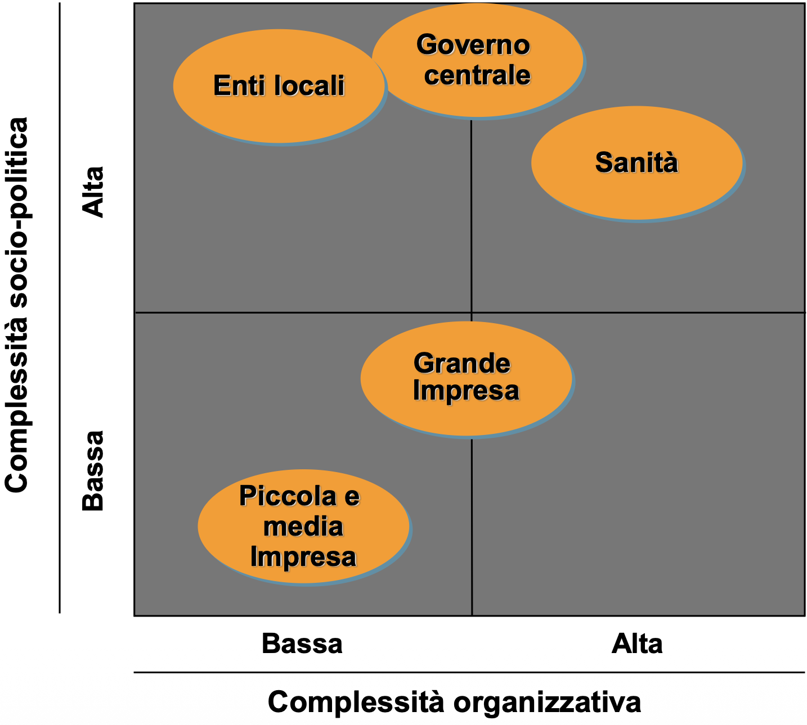

## Strumenti analitici

(Appunto al lettore la parte degli strumenti analiti e il capitolo successivo del "L'Information Technology come fattore di successo" con gli esempi è stata spiegata interamente da Claude prendendo gli appunti del prof.)

Nuovi strumenti analitici aiutano a concepire nuovi modi di organizzare il flusso di lavoro:

### 1. **Azienda estesa**

Significa abbattere i confini rigidi dell'organizzazione e gestire i processi come se fossero un flusso continuo che attraversa fornitori, partner e clienti.

Esempio pratico: Invece di avere un reparto acquisti che ordina materiali solo quando servono, il fornitore ha accesso diretto ai dati di produzione e rifornisce automaticamente il magazzino (come nel sistema Just-in-Time di Toyota). Il processo di approvvigionamento "esce" dai confini aziendali.

### 2. **Parallelizzazione**

Trasformare attività che tradizionalmente si facevano una dopo l'altra in attività che si possono fare simultaneamente.

Esempio pratico: Nello sviluppo di un nuovo prodotto, invece di fare prima tutto il design, poi l'ingegnerizzazione, poi il marketing (sequenziale), si fanno lavorare i team contemporaneamente con comunicazione continua. Questo riduce drasticamente i tempi di lancio sul mercato.

### 3. **Riallocazione**

Invece di avere esperti centralizzati che vengono consultati ogni volta, si incorpora la loro conoscenza in sistemi, software o strumenti che tutti possono usare autonomamente.

Esempio pratico: Anziché dover chiamare ogni volta l'ufficio legale per verificare un contratto, si crea un software con template intelligenti e checklist che permettono ai manager di validare contratti standard da soli. L'expertise legale è "distribuita" tramite il sistema.

### 4. **Eliminazione**

Mettere in discussione le attività tradizionali chiedendosi: "Questo passaggio serve davvero?" Spesso si fanno cose "perché si sono sempre fatte così".

Esempio pratico: Eliminare le approvazioni multiple per spese sotto una certa soglia, eliminare report che nessuno legge veramente, rimuovere passaggi burocratici che servivano a controllare problemi che non esistono più. Gli "steccati" sono le barriere artificiali tra reparti (es. "non è compito mio, è del reparto X").

### 5. **Cicli di miglioramento continuo**

Costruire meccanismi di feedback nel processo stesso, in modo che si auto-migliori nel tempo basandosi sui dati reali.

Esempio pratico: Un sistema di customer service che traccia automaticamente i tempi di risposta, la soddisfazione del cliente e i problemi ricorrenti, mostrando dashboard in tempo reale al team. Questo permette aggiustamenti continui invece di aspettare una revisione annuale.

## L'Information Technology come fattore di successo

L'IT va strategicamente interpretata come fattore di successo ottimale per le prestazioni dei processi di business.

Il concetto chiave è che la tecnologia non è solo un supporto operativo, ma un elemento strategico che può trasformare radicalmente come l'azienda compete e crea valore.

### Impatti tipici sulla Catena del Valore:

La Catena del Valore di Porter identifica le attività primarie e di supporto di un'azienda. L'IT può trasformare ogni anello avendo un impatto positivo su essa.

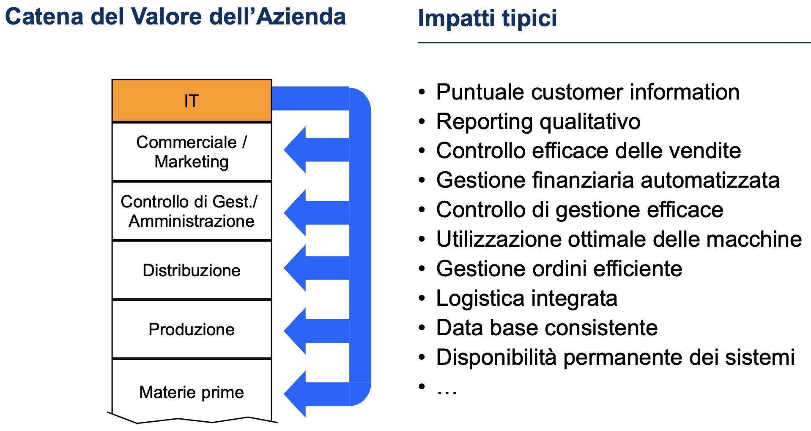

## Tecnologie informatiche "abilitanti" per il reengineering

Le tecnologe 'abilitanti' sono quelle che non migliorano semplicemente l'esistente, ma rendono possibile fare cose completamente nuove.

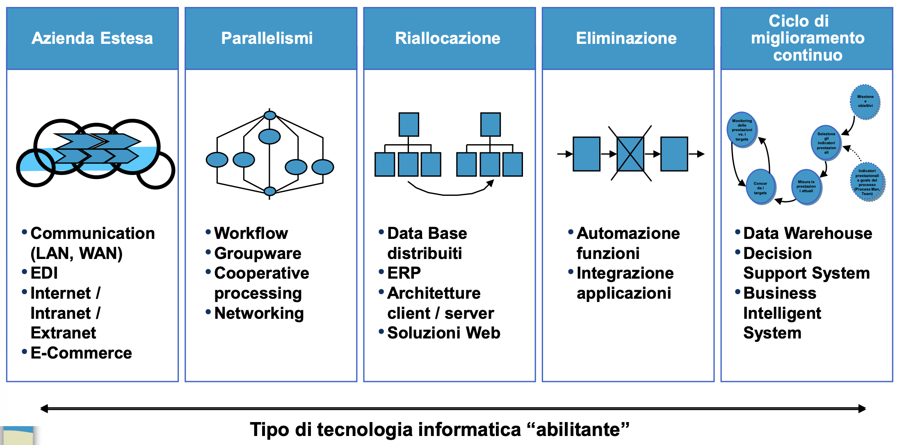

## L'IT deve essere sviluppata contestualmente con il "modello d'impresa"

Il modello di impresa (o business model) è la logica con cui un'azienda crea, distribuisce e cattura valore. In altre parole, descrive come un'impresa fa affari e genera profitto.

Non si può prima definire il modello di business e poi "aggiungere" l'IT, né viceversa.

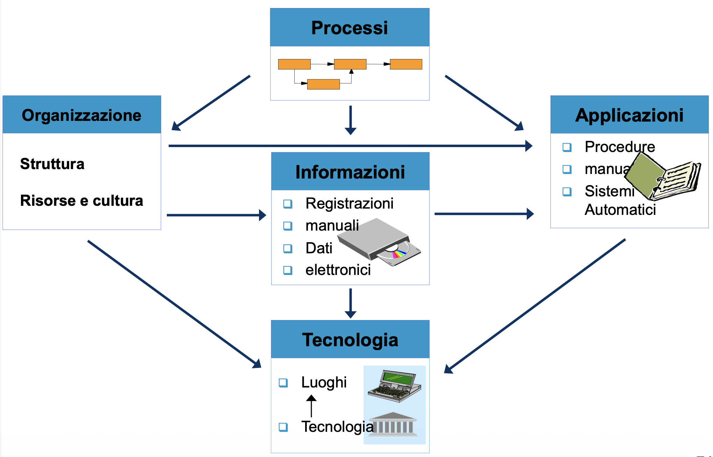

Esempio: Amazon non ha prima deciso di fare e-commerce e poi aggiunto l'IT. Ha ripensato l'intero modello di retail sfruttando le possibilità di internet, creando sistemi di raccomandazione, logistica automatizzata, cloud AWS, tutto insieme.

## I ruoli della tecnologia nell'innovazione

### La tecnologia è un fattore abilitante dell'innovazione:

- L'adozione di processi paralleli è abilitata dai software di collaboration
- Senza internet il commercio elettronico non esisterebbe
- Senza il machine learning non si potrebbero creare applicazioni di AI

### Due tipologie di innovazione:

#### 1. **Innovazioni technology-driven**

Si basano su tecnologie estremamente innovative (con riferimento al momento dell'innovazione) tale per cui gli stakeholder del servizio/problema non riescono neanche a immaginarne l'utilizzo.

**Esempio con azienda che lavora per bandi a progetto**: Ogni anno escono centinaia di bandi ma la divisione può studiarne solo un numero limitato. Si può chiedere a un LLM di fare un pre-screening di TUTTI i bandi e indicare quelli potenzialmente interessanti. Il personale dell'ufficio bandi NON conosce le potenzialità di un LLM e NON considera l'attività di analisi come un problema.

#### 2. **Innovazioni application-driven**

Si basano su tecnologie note (con riferimento al momento dell'innovazione) tale per cui gli stakeholder ne conoscono le potenzialità. L'innovazione sta nell'immaginarsi l'utilizzo nello specifico contesto.

**Esempio app come MyCicero per pagare il parcheggio**: pagamento del parcheggio senza dover cercare la colonnina per il pagamento e senza avere monetine. Permettono inoltre di allungare/accorciare dinamicamente la sosta. Si basano su tecnologie note da 15 anni ma l'innovazione è legata all'utilizzo nel contesto specifico e agli accordi con le PA.

**La maggior parte delle innovazioni di processo si basano sull'adozione di software con capacità note (ERP, CRM, ecc.)**

## Il ridisegno dei processi: un modello in 6 fasi

### Fase 1: **Condivisione obiettivi aziendali**

#### Attività principali:

- Documentare la visione aziendale di strategie ed obiettivi
- Rilevare piani di sviluppo, eventi chiave già pianificati
- Rilevare ruolo e attese dell'Azienda, dei clienti e "partecipi" del processo

#### Risultati:

- Quadro di riferimento degli orientamenti strategici e obiettivi di sviluppo
- Linee guida per lo sviluppo dell'attività
- Modello di interrelazione volumi, costi, servizio

---

### Fase 2: **Definizione linee guida**

#### Attività principali:

- Selezionare i processi di gestione da considerare
- Identificare gli skill necessari e selezionare le risorse
- Strutturare i team e pianificare le attività
- Sviluppare e promuovere il programma di comunicazione

#### Risultati:

- Quadro processi e priorità
- Macro target definiti
- Risorse da coinvolgere e composizione dei team
- Struttura operativa del programma
- Approccio alla comunicazione, con programma e scopi

---

### Fase 3: **Analisi di base e Benchmark**

#### Attività principali:

- Analizzare i processi attuali ed i sottoprocessi chiave
- Confrontare i processi con maggiore potenziale di miglioramento con le Best Practice
- Analizzare e definire le priorità per i processi chiave ed i sottoprocessi
- Sviluppare processi interni ed esterni per la definizione dei requisiti dei clienti
- Definire le priorità relative alle opportunità di miglioramento

#### Output fondamentali:

- **Diagrammi di flusso dei processi** (Livello macro)
- **Mappatura dei processi**: Processi → Portatori di interesse
- **Benchmark con i concorrenti**: Criteri di misurazione → Prassi migliore vs Situazione attuale
- **I rischi competitivi**
- **Le opportunità e le necessità di miglioramento**
- **Gli output dei processi**: Output, Costo, Valore
- **Il posizionamento degli output sulla matrice costo-valore**
- **Sessioni per la ricostruzione dei requisiti dei clienti**: Problema/opportunità → Causa origine → Possibile soluzione
- **Lista aggregata delle opportunità**: Area progetto, Benefici, Costi, Rischi, Rilevanza strategica
- Crescita della domanda, Obiettivi di redditività, Servizi condivisi

### Early Wins (Risultati immediati)

**Risultati immediati e tangibili sono essenziali**:

- Giustificano l'impegno delle risorse
- Determinano la credibilità del processo di gestione del cambiamento
- Forniscono la prova che il management è impegnato nel processo di cambiamento
- Creano entusiasmo tra le persone

---

### Fase 4: **Sviluppo dei concetti innovativi**

### Fase 5: **Progettazione del cambiamento**

#### Attività principali:

- Sviluppare la visione di un processo eccellente
- Disegnare le opzioni per i nuovi processi
- Definire i requisiti in termini di risorse e tecnologia

#### Output fondamentali:

- **Diagrammi di flusso**
- **Cambiamenti necessari**
- **Azioni prioritarie - Lista dei cambiamenti**: 1, 2, 3...
- **Tabella**: Obiettivi → Cambiamenti richiesti → Processi coinvolti
- **Interfacce critiche dei nuovi processi**: Matrice Processi × Processi (A, B, C...)
- **Richieste di risorse umane**
- **Richieste di investimenti**
- **Disegno dei futuri macro processi**: Processi → Portatori di interesse

---

### Fase 6: **Pianificare l'implementazione**

#### Attività principali:

- Preparare e concordare piano d'implementazione
- Accordarsi sulla futura struttura organizzativa post-implementazione
- Accordarsi sull'architettura ed il piano di migrazione
- Allineare i criteri di misurazione delle prestazioni

#### Risultati:

- **Programma** con i passaggi fondamentali
- Struttura organizzativa futura
- Architettura e piano di migrazione
- Criteri di misurazione delle prestazioni allineati

---

## La realizzazione del cambiamento è un processo continuo

### Attività chiave:

- Condurre incontri frequenti sullo stato di avanzamento
- Impiegare le risorse in modo flessibile, in funzione delle necessità realizzative
- Incoraggiare, supportare e guidare tutti coloro che stanno lavorando per il processo di cambiamento
- Monitorare i sistemi di misurazione dei processi
- Individuare le azioni di miglioramento delle prestazioni
- Comunicare i risultati a tutta l'organizzazione

### Risultato:

- Gestione del processo di cambiamento
- Il raggiungimento dei risultati viene monitorato e comunicato

---

## Integrazione delle attività

In un programma di trasformazione aziendale il "process reengineering" va integrato con la realizzazione dei nuovi supporti informatici e la gestione del cambiamento.

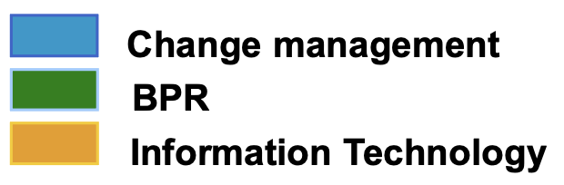

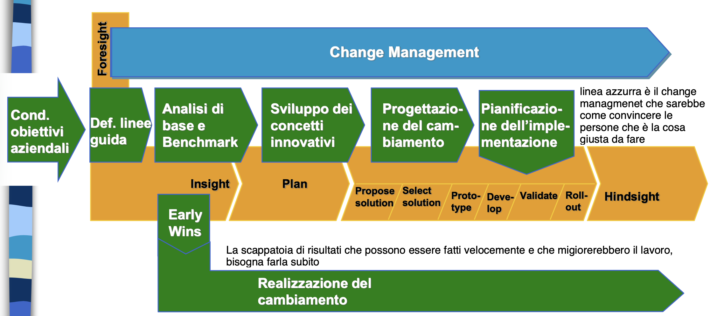

## Modellazione fuzionale con Data Flow Diagram (Flusso di attività)

I dataflow diagram sono diagrammi per la modellazione funzionale di dati e flussi in cui ogni bolla è una funzione che fa qualcosa per un determinato scopo.

I DFD:

1. Traggono origine dalla teoria dei grafi e sono stati utilizzati anche precedentemente all’avvento dei computer per la gestione delle informazioni.
2. Sono stati impiegati per la prima volta, nel settore dell’ingegneria del software, solo verso la metà degli anni 70.
3. Non esiste in letteratura a tutt’oggi una definizione universalmente accettata e sono presenti molteplici differenti formulazioni operative.

Che cosa modella un DFD?

1. Un sistema è visto come una rete di processi funzionali
   interconnessi da depositi di dati.
2. I DFD enfatizzano le operazioni effettuate sulle informazioni e le
   dipendenze funzionali che vengono a crearsi fra i vari processi in
   base ai flussi di informazione.
3. I processi possono essere definiti a qualunque livello di astrazione,
   raffinabili mediante scomposizione gerarchica in un insieme di
   processi più elementari.

Le etità sono:

a. processi o bolle che trasformano dati
b. flussi che muovono dati
c. agenti esterni (terminatori) che produzono e condumano dati- Non fanno parte dell'azienda ma servono (es: fattura inviata da una banca che non fa parte dell'azienda)
d. deposito di dati (fisici o virtuali) che memorizzano informazioni in modo passivo

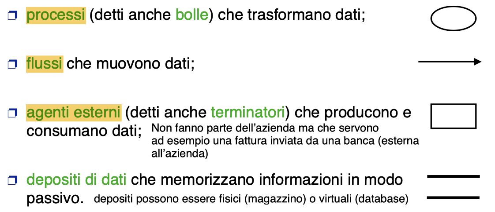

### Definizione formale

un DFD è una quartupla <P,D,A,F> dove:

- P = {p1,p2,...,pn} è un insieme finito, non vuoto, di processi;
- D = {d1,d2,...,dr} è un insieme finito di depositi;
- A = {a1,a2,...,as} è un insieme finito di agenti;
- F= { f ∈ (P×(P∪D∪A)) ∪ ((P∪D∪A)×P) } è un insieme finito di flussi.

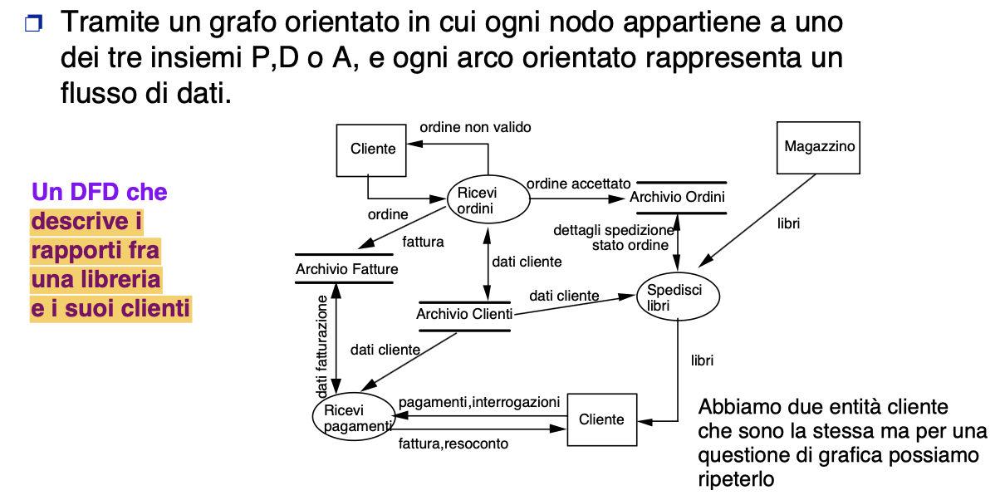

### Consigli

- Nomi univoci per identificare processi, flussi di dati, agenti e
  depositi.
- Non rappresentare le eccezioni e il trattamento degli errori,
  rimandando questi dettagli alle fasi finali dell’analisi.
- Un DFD non è un diagramma di flusso, dove le frecce indicano un
  ordinamento negli eventi.
- In alcune estensioni, come nella notazione OMT è possibile
  rappresentare anche flussi di controllo; anticiparli in un DFD
  comporta di fatto una duplicazione se si usa anche un modello
  dinamico.

### Regole

- Scegliere nomi significativi per i processi, flussi, depositi, e agenti.
- Numerare i processi.
- Disegnare i DFD seguendo criteri estetici.
- Evitare DFD eccessivamente complessi.
- Accertarsi della coerenza interna di un DFD e che sia coerente con
  quelli ad esso associati.

### Vincoli

- Evitare processi a consumo infinito (pozzi).
- Sospettare di processi a generazione spontanea.
- Depositi a sola lettura o a sola scrittura sono rari.
- Non devono esistere flussi di dati fra :
  1. due agenti esterni,
  2. due depositi,
  3. un’entità esterna e un deposito.

Ci sono anche DFD con flussi di controllo e multilivello (conta che un'applicazione di medie dimensioni richiede dai 3 ai 6 livelli) nel quale vengono specializzate specifiche parte e cambia il livelo di dettaglio in cui vengono viste.

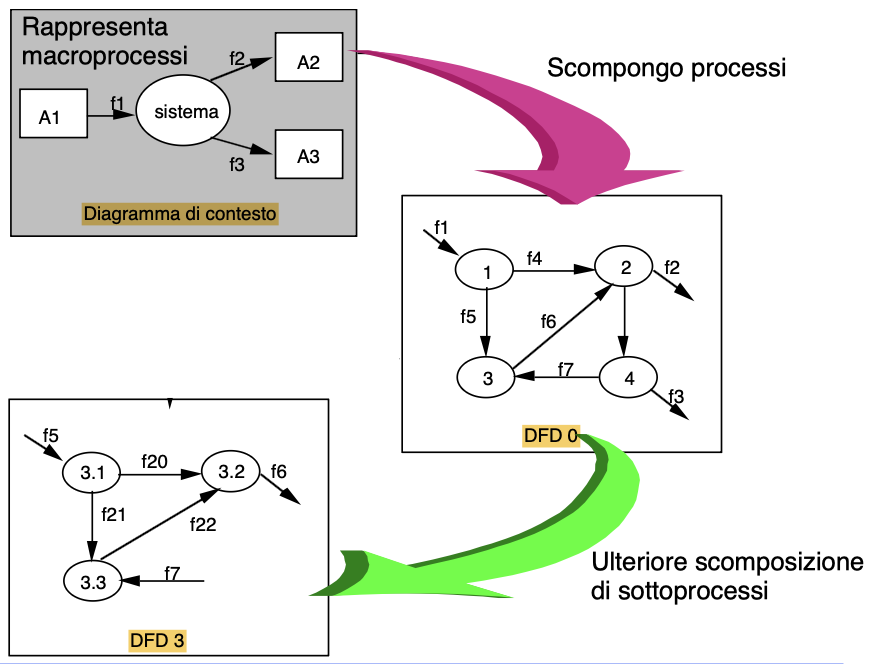

### Strategie

top-down

- decomposizione di un processo in una serie di
  sottoprocessi chiaramente identificabili e indipendenti.

bottom-up

- a partire da una collezione di concetti elementari si costruiscono via via
  le connessioni fra essi.

mixed

- raffinamento di un DFD di massima in stadi successivi con tecniche top-down e bottom-up

outside-in

- parte dalle interfacce con il sistema e propaga in avanti gli ingressi
  evidenziando i processi coinvolti nei flussi di dati o, in alternativa,
  propaga all’indietro le uscite.
